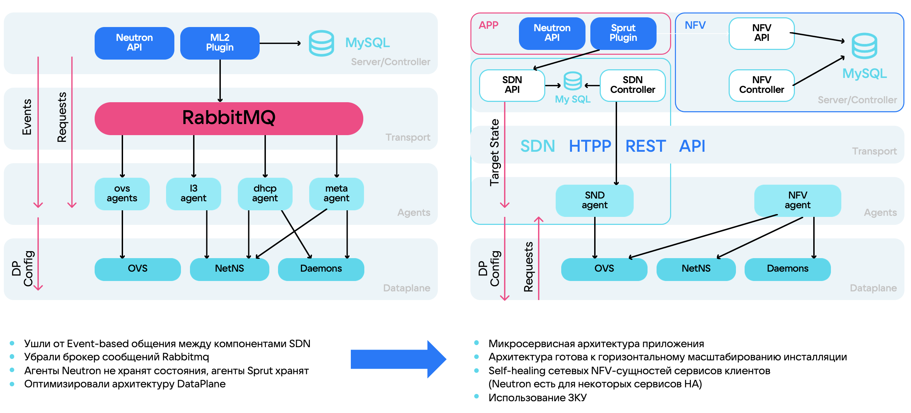
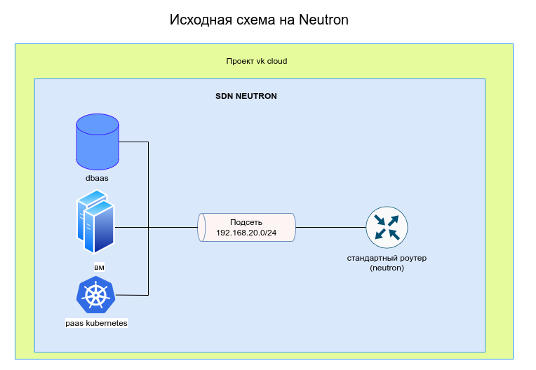
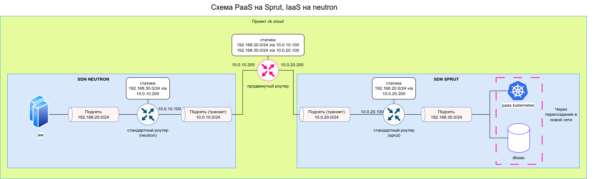
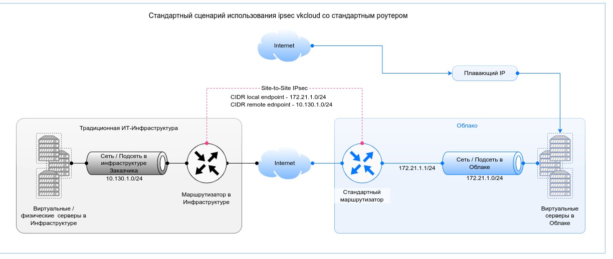
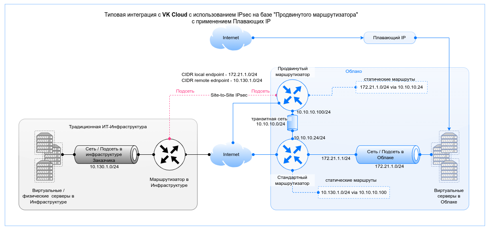
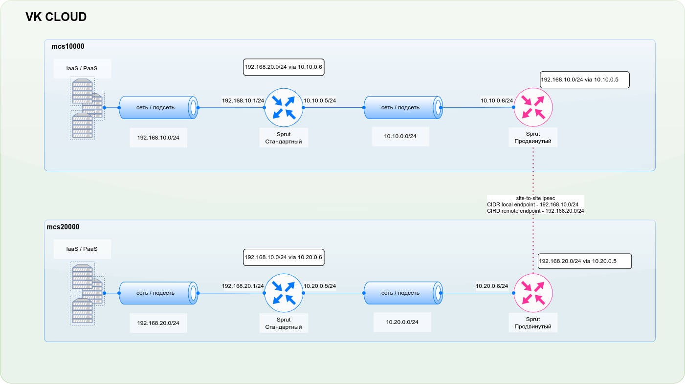
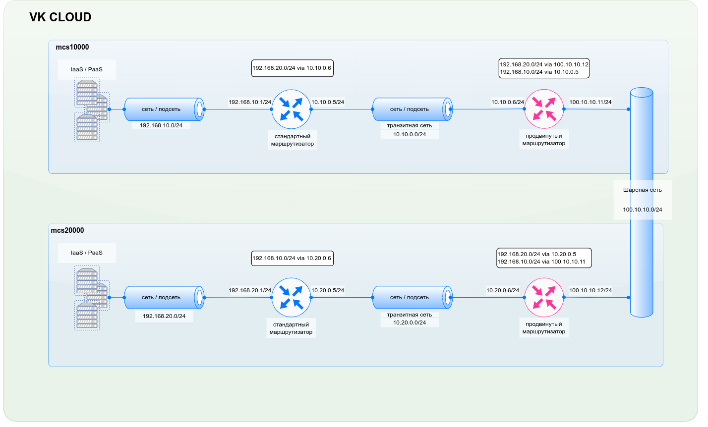

# Полное руководство по миграции на SDN SPRUT

В данном руководстве описаны причины и премущества миграции с SDN Neutron на SDN Sprut. Приведены лучшие практики, типовые кейсы и способы миграции сервисов VK CLOUD.

- [Что такое SDN](#что-такое-sdn)
- [Сравнение SDN Neutron и SDN Sprut](#сравнение-sdn-neutron-и-sdn-sprut)
- [Для чего нужна миграция](#для-чего-нужна-миграция)
  - [Особенности архитектуры](#особенности-архитектуры)
  - [Функциональные преимущества](#функциональные-преимущества)
  - [Нефункциональные преимущества](#нефункциональные-преимущества)
- [Инструменты миграции](#Инструменты-миграции)
- [Миграция на SDN Sprut](#Миграция-на-SDN-Sprut)
  - [Базовый кейс миграции проекта на IaaS](#Базовый-кейс-миграции-проекта-на-IaaS)
  - [Подготовка и анализ текущей инфраструктуры](#Подготовка-и-анализ-текущей-инфраструктуры)
  - [Создание сетевых ресурсов SDN Sprut](#Создание-сетевых-ресурсов-SDN-Sprut)
  - [Миграция IaaS](#Миграция-IaaS)
      - [Миграция terraform-state IaaS](#Миграция-terraform-state-IaaS)
      - [Смена плавающих ip](#Смена-плавающих-ip)
  - [Миграция PaaS](#Миграция-PaaS)
      - [Балансировщики нагрузки](#Балансировщики-нагрузки)
      - [Файловое хранилище NFS/CIFS](#файловое-хранилище-nfscifs)
      - [Kubernetes](#Kubernetes)
      - [Базы данных](#базы-данных)
      - [VPN IPsec](#VPN-IPsec)
  - [Пост-миграционное тестирование и оптимизация](#Пост-миграционное-тестирование-и-оптимизация)
  - [Документирование и обучение](#Документирование-и-обучение)
- [План развития и внедрения SDN Sprut](#План-развития-и-внедрения-SDN-Sprut)

---


# Что такое SDN
Software Defined Network — концепция выведения сетевых функций из специализированного железа на программный уровень и дальнейшего разделения ответственности на разные слои. SDN необходима для организации распределенной инфраструктуры на 1000+ серверов, быстрой миграции ресурсов внутри инфраструктуры и быстрого внесения изменений. SDN является инструментом управления оверлей-сетями и основой облачной инфраструктуры, обеспечивая маршрутизацию, firewall и сетевую связность между сервисами.


> Software Defined Network - Основа облачной инфраструктуры

Сценарии использования SDN:
- Организация связности внутри проекта клиента
- Виртуальные роутеры, сети и подсети пользователя
- Доступ в Интернет, внешние подключения в проект клиента
- IP-address-менеджмент
- Настройка правил маршрутизации

Характеристики SDN:
- Пользователи продукта: end-users облака и вышестоящие продукты
- Высокие требования к надежности продукта
- Долгие этапы проработки и внедрения изменений

# Сравнение SDN Neutron и SDN Sprut
Neutron - это SDN, полностью интегрированный с платформой Openstack. Он предоставляет большой набор сетевых сервисов: виртуальные маршрутизаторы, балансировщики нагрузки, VPN, DNS, Security Group. Однако у Neutron есть ограничения по масштабируемости и добавлению новой функциональности.


Долгое время в VK Cloud использовался Neutron, но параллельно разрабатывалось собственное решение SDN Sprut, который решает проблемы в архитектуре Neutron, связанные с масштабируемостью и надёжностью.
Причины разработки собственного SDN:
1. Ограничения со стороны SDN Neutron в изменении архитектуры и развитии функциональности:
   - Архитектура Neutron является трудно масштабируемой, что не позволяет эффективно наращивать инфраструктуру облака.
   - Добавление новой функциональности в Neutron является сложным или невозможным из-за особенностей его архитектуры.
   - Neutron плохо справляется с большими перестроениями сети (full-sync) из-за особенностей своей архитектуры.

1. Необходимость соответствия требованиям к SDN в VK Cloud:
   - Поддержка масштабирования инсталляции и роста облака.
   - Гибкость интеграции с инфраструктурой VK Cloud или заказчика.
   - Обеспечение необходимого SLA продуктов платформы.
   - Сокращение time-to-market при реализации запросов пользователей.
   - Независимость от сообщества (community) при развитии продукта.
   - Высокая производительность сети облака.

1. Ограниченные возможности развития существующих SDN-решений:
   - Замена Neutron на другие аналогичные решения (Tungsten Fabric, Open Contrail, OVN) также имеет ограничения и требует времени на интеграцию с облаком.
   - Реализация собственного SDN позволяет воплотить все необходимые требования к продукту.

В результате, разработка собственного SDN-решения (SDN Sprut) стала оптимальным выбором для VK Cloud, позволяющим преодолеть ограничения существующих решений и обеспечить соответствие всем требованиям к сетевой подсистеме облачной платформы.

На данной схеме предоставлена архитектура и схема работы обоих SDN. 


Отличительные особенности SDN Sprut:
1. Для sprut агентов предусмотрена возможность постоянного сбора информации о настройках Data plane при помощи HTTP API. В Neutron конфигурация доставляется при помощи очереди, без проверки что она действительно пришла. В случае ошибок в конфигурации необходима пересборка портов, то есть full sync, который занимает время.
1. В sprut больше нет событийной модели общения между компонентами. Теперь агенты всегда получают от сервера целевое состояние, в котором должны быть, и непрерывно перезапрашивают его. Получился аналог постоянного Full Sync, при котором агенты сравнивают текущее состояние Data plane с целевым состоянием от сервера, накладывают необходимый diff на Data plane и приводят его к актуальному состоянию. В теории автоматического управления такой подход называют замкнутым контуром управления.
1. Ушли от Event-based общения между компонентами. RabbitMQ заменён обычным HTTP REST API. Он лучше справляется с большими массивами данных о таргетном состоянии агентов, его проще разрабатывать и мониторить. Пропала ещё одна потенциальная точка отказа.
1. Микросервисная архитектура, готовая к горизонтальному масштабированию
1. Self-healing сетевых NFV-сущностей сервисов клиентов

> Подробнее о предпосылках создания собственной SDN в VK Cloud, а также об отличительных особеностях работы читайте в [статье на Хабр](https://habr.com/ru/companies/vk/articles/763760/).

# Для чего нужна миграция
SDN Sprut является полностью собственной разработкой VK Cloud. Основная идея - создать более гибкое, масштабируемое и производительное SDN-решение, которое будет соответствовать всем требованиям VK Cloud и позволит быстро разрабатывать и внедрять новую функциональность. Такой подход, повышает надежность и доступность сетевой инфраструктуры облака.
Ключевые преимущества миграции на SDN Sprut:
1. Прекращение поддержки Neutron:
   VK Cloud планирует прекратить поддержку SDN Neutron в будущем. Это означает, что клиенты, оставшиеся на Neutron, могут столкнуться с проблемами безопасности и отсутствием обновлений.

1. Улучшенная производительность:
   SDN Sprut предлагает более высокую производительность и эффективность по сравнению с Neutron. Это приводит к улучшению работы сетевой инфраструктуры и снижению задержек вашей инфраструктуры внутри облачного проекта.

1. Расширенные функциональные возможности:
   Sprut предоставляет более широкий набор сетевых функций и возможностей, которые могут быть полезны для оптимизации и масштабирования инфраструктуры клиентов.

1. Лучшая интеграция с экосистемой VK Cloud:
   Как собственное решение VK Cloud, Sprut лучше интегрируется с другими сервисами и инструментами платформы, обеспечивая более гладкий пользовательский опыт.

1. Поддержка современных технологий:
   Sprut разработан с учетом современных требований к сетевой виртуализации, поддерживает новейшие технологии и архитектурные стандарты проектирования SDN решений.

1. Подготовка к будущим обновлениям:
   Миграция на Sprut позволит клиентам быть готовыми к будущим обновлениям и улучшениям платформы VK Cloud в полностью автоматизированном режиме.

1. Техническая поддержка:
   VK Cloud будет сосредоточена на поддержке и развитии Sprut, что означает более быстрое решение проблем и внедрение новых функций для этой SDN.

1. Соответствие стратегии развития VK Cloud:
    Использование Sprut соответствует долгосрочной стратегии развития VK Cloud, что обеспечивает клиентам стабильность и уверенность в будущем их инфраструктуры.

Миграция на SDN Sprut позволит клиентам VK Cloud оставаться на переднем крае технологий, обеспечивая при этом надежность, производительность и безопасность их сетевой инфраструктуры.
Также, SDN Sprut обладает рядом функциональных и нефункциональных преимуществ, улучшенной производительностью как Contrl Plan, так и Data Plane.

## Особенности архитектуры

1. Микросервисная архитектура:
   - SDN Sprut построен по микросервисной архитектуре, что позволяет легко масштабировать отдельные компоненты системы.
   - Каждый сервис отвечает за свою функциональность и может быть развернут независимо от других.
   - Это обеспечивает гибкость и высокую производительность системы.

2. Отказоустойчивость:
   - SDN Sprut использует концепцию "self-healing" - сетевые компоненты могут самостоятельно восстанавливаться при сбоях.
   - Применяется замкнутый контур управления (closed control loop), который позволяет автоматически реагировать на изменения в системе.
   - Это повышает надежность и доступность сетевых сервисов.

3. Продвинутые сетевые сервисы:
   - SDN Sprut предоставляет более расширенный набор сетевых сервисов по сравнению с Neutron.
   - Это включает в себя продвинутые маршрутизаторы с поддержкой динамической маршрутизации, Direct Connect для подключения к облаку через выделенные каналы, общие сети для объединения проектов клиентов.
   - Данные сервисы позволяют реализовывать более сложные сетевые топологии и сценарии использования.

4. Производительность:
   - SDN Sprut показывает значительное ускорение по сравнению с Neutron - до 87% при работе с трафиком внутри сети..
   - Оптимизация архитектуры DataPlane и отказ от Event-based модели общения между компонентами позволили повысить производительность.

5. Гибкость и расширяемость:
   - Архитектура SDN Sprut спроектирована с учетом возможности быстрого добавления новой функциональности.
   - Отсутствие ограничений, присущих Neutron, позволяет разрабатывать и внедрять новые сервисы в более короткие сроки.
   - Это дает возможность быстро реагировать на потребности бизнеса и клиентов.

В целом, SDN Sprut представляет собой более современное, гибкое и производительное решение для управления сетевой инфраструктурой в облаке VK Cloud по сравнению с Neutron.

## Функциональные преимущества

основные функциональные преимущества SDN Sprut по сравнению с Neutron:

1. Продвинутый маршрутизатор:
   - Поддержка динамической маршрутизации с использованием протокола BGP
   - Возможность построения отказоустойчивой схемы маршрутизации

2. Direct Connect:
   - Возможность подключения к облаку через выделенные каналы связи

3. Общие сети:
   - Объединение нескольких проектов клиентов в одном регионе облака в единую сеть

4. Изолирование клиентского трафика для PaaS-сервисов:
   - Обеспечение изоляции трафика между различными клиентами в рамках PaaS-сервисов

5. Децентрализованный DHCP:
   - Распределенная архитектура DHCP-сервиса для повышения отказоустойчивости

6. Приватный DNS:
   - Возможность использования собственного DNS-сервиса внутри облака

7. Интеграционные механизмы:
   - Поддержка интеграции через REST API и другие механизмы

8. Высокая производительность:
   - Ускорение операций с Control Plane сетb до 34% по сравнению с Neutron

9. Готовность к горизонтальному масштабированию:
   - Микросервисная архитектура и использование замкнутого контура управления позволяют легко масштабировать SDN-компоненты

10. Самовосстановление сетевых компонентов:
    - Механизмы self-healing для автоматического восстановления работоспособности сетевых сущностей

Таким образом, SDN Sprut предоставляет более расширенную функциональность, высокую производительность и готовность к масштабированию по сравнению с Neutron, что позволяет лучше удовлетворять требования облачной платформы VK Cloud.

## Нефункциональные преимущества

1. Повышение производительности без фактического изменения цены владения:
   - Архитектура Sprut оптимизирована для высокой производительности, что позволяет достичь ускорения до 34% по сравнению с Neutron без увеличения затрат на инфраструктуру.
   - Оптимизация DataPlane и использование современных технологий позволяют эффективнее использовать ресурсы.

2. Повышение производительности API и UI:
   - Благодаря микросервисной архитектуре Sprut, API и UI стали более отзывчивыми и производительными.
   - Сокращение времени отклика API и UI повышает удобство использования для пользователей.

3. Быстрое получение нового функционала VK Cloud:
   - Гибкая архитектура Sprut позволяет быстрее разрабатывать и внедрять новые сетевые сервисы.
   - Отсутствие ограничений платформы Neutron ускоряет время вывода новых возможностей на рынок.

4. Рост эффективности обработки данных: скорость, объем, стоимость:
   - Оптимизированная архитектура Sprut позволяет обрабатывать больший объем данных с меньшими затратами.
   - Использование современных технологий хранения и обработки данных повышает их скорость и снижает стоимость.

5. Event Driven Architecture:
   - Sprut поддерживает событийно-ориентированную архитектуру, что повышает гибкость и масштабируемость системы.
   - Реакция на события в режиме реального времени улучшает отказоустойчивость и самовосстановление сетевых компонентов.

6. Автоконфигурация и автомониторинг:
   - Sprut предоставляет возможности для автоматической конфигурации и мониторинга сетевой инфраструктуры.
   - Это позволяет сократить ручные операции, повысить надежность и скорость реакции на изменения.

Таким образом, нефункциональные преимущества Sprut направлены на повышение производительности, гибкости, масштабируемости и эффективности управления сетевой инфраструктурой VK Cloud.


# Инструменты миграции

| Скрипт | Документация | Краткое описание |
|----------|:-------------:|------:|
| [check-if-all-sprut-sg-present.sh](/check-if-all-sprut-sg-present.sh) | [migrator-multiple](/docs/scripts/migrator-multiple.md) | |
| [](/) | [check-if-all-sprut-sg-present](/docs/scripts/check-if-all-sprut-sg-present.md) | |
| [copy-ipsec.sh](/copy-ipsec.sh) | [copy-ipsec](/docs/scripts/copy-ipsec.md) | |
| [copy-loadbalancer.sh](/copy-loadbalancer.sh) | [copy-loadbalancer](/docs/scripts/copy-loadbalancer.md) | |
| [copy-router-and-networks.sh](/copy-router-and-networks.sh) | [copy-router-and-networks](/docs/scripts/copy-router-and-networks.md) | |
| [copy-security-group.sh](/copy-security-group.sh) | [copy-security-group](/docs/scripts/copy-security-group.md) | |
| [migrator.sh](/migrator.sh) | [migrator](/docs/scripts/migrator.md) | |
| [migrator-multiple.sh](/migrator-multiple.sh) | [migrator-multiple](/docs/scripts/migrator-multiple.md) | |
| [modify-terraform-state.sh](/modify-terraform-state) | [modify-terraform-state](/docs/scripts/modify-terraform-state.md) | |

Описание скриптов, список
Алгоритмы работы
Документация
Ссылка на подробный гайд

# Миграция на SDN Sprut

Миграция с SDN Neutron на SDN Sprut в VK Cloud предполагает переход на более современную и эффективную сетевую архитектуру. Последовательность действий при миграции отражена в виде блок-схемы:


Все действия можно разбить на основные этапы:
1. [Подготовка и анализ текущей инфраструктуры](#Подготовка-и-анализ-текущей-инфраструктуры)
2. [Создание сетевых ресурсов SDN Sprut](#Создание-сетевых-ресурсов-SDN-Sprut)
3. [Миграция IaaS](#Миграция-IaaS)
4. [Миграция PaaS](#Миграция-PaaS)
5. [Пост-миграционное тестирование и оптимизация](#Пост-миграционное-тестирование-и-оптимизация)
6. [Документирование и обучение](#Документирование-и-обучение)

## Базовый кейс миграции проекта на IaaS

Пример миграции проекта на IaaS описывает наиболее оптимальную стратегию подготовки и переноса инфраструктуры на SDN Sprut. Схема последовательности действий отражена в виде блок-схемы:


### Последовательность шагов


5. Подготовить список виртуальных машин для миграции, посмотреть количество сетевых подключений. Скрипт для миграции способен переносить вм только с одним сетевым подключением. Можно использовать команду:
```bash
openstack server list -c ID -c Name -c Networks
```

Пример вывода:
```shell
+--------------------------------------+--------------------------------------------+---------------------------------------------------+
| ID                                   | Name                                       | Networks                                          |
+--------------------------------------+--------------------------------------------+---------------------------------------------------+
| 7fb03142-4825-47bc-954a-bbadc89a94d6 | vm_1                                       | test-sprut=10.0.0.64; vpn_net=10.0.0.13, 10.0.0.6 |
| 8f0d6d98-cd80-452f-b4cc-7aecff42c149 | migration-target-master-0                  | vpn_net=10.0.0.29                                 |
| 02fe2cde-6526-4fcc-a80a-d996d6482894 | migration-target-default-group-0           | vpn_net=10.0.0.31                                 |
+--------------------------------------+--------------------------------------------+---------------------------------------------------+
```
В разделе network указано количество подключений у виртуальной машины.

6. Подготовить файл со списком мигрируемых для виртуальных машин [скрипта миграции](migrator-multiple.sh).

Формат .csv файла (разделитель символ запятая ,):
```bash
<имя виртуальной машины для миграции>,<имя целевой сети на спруте>,<имя целевой подсети на спруте>,<id плавающего ip sprut>
<имя виртуальной машины для миграции>,<имя целевой сети на спруте>,<имя целевой подсети на спруте>,<id плавающего ip sprut>
...
```

Пример файла migration-inputs.csv:
```csv
migration-target-master-0,vpn_net-sprut,vpn_subnet-sprut
migration-target-default-group-0,vpn_net-sprut,vpn_subnet-sprut
```
7. Выделить техническое окно, во время которого сервисы могут не работать. На время переключения виртуальная машина потеряет сетевую связность. На одну виртуальную машину уходит ~45 секунд. 
8. Запустить скрипт миграции.

```bash
./migrator-multiple.sh <название csv файла>
```

Если используются секьюрити группы ssh+www, all, для копирования их во время миграции необходимо указать флаги:

```bash
./migrator-multiple.sh <название csv файла> \
 --all-secgroup-sprut-id=<id группы на спруте> \
 --ssh-www-secgroup-sprut-id=<id группы на спруте>
```

ID можно посмотреть в графическом интерфейсе "Виртуальные сети" -> "Настройки firewall" и посмотреть аналогичные группы с тегом "Sprut".


После запуска скрипта оследовательно для каждой вм будет такой вывод:

```shell
Processing migration for server: yaklass-private-0
Executing step 1: Capturing port information
Migrated port yaklass-private-0_migrated_port exists, checking for attachment...
Source Port ID is:        8044ec65-3340-497a-9338-bdd6c47cec0e
Source Port IP Addr is:   192.168.199.28
Source Port MAC Addr is:  fa:16:3e:cd:39:fc
********************************************
Executing step 2: Capturing server ID and security group names
Server ID is:             e12ee46f-33ed-481a-848f-78a58b12cda8
Security Groups captured: default
********************************************
Executing step 3: Creating port with source IP and MAC
Port named yaklass-private-0_migrated_port already exists. Port ID: af3194a6-40be-447a-b0b5-ffe0f3db2c21
********************************************
Executing step 4: Disconnecting existing port from server
Running command: openstack server remove port e12ee46f-33ed-481a-848f-78a58b12cda8 8044ec65-3340-497a-9338-bdd6c47cec0e
Step 4 complete (Source port disconnected from server yaklass-private-0)
********************************************
Executing step 5: Connecting new port to server
Running command: openstack server add port e12ee46f-33ed-481a-848f-78a58b12cda8 af3194a6-40be-447a-b0b5-ffe0f3db2c21
Step 5 complete (New port attached to server)
********************************************
Executing step 6: Setting security groups on new port
Setting captured groups: default
Original Security Group: default
Modified Security Group ID: d7881417-4ac4-404c-82b6-311da32b6386
Running command: openstack port set --security-group d7881417-4ac4-404c-82b6-311da32b6386 af3194a6-40be-447a-b0b5-ffe0f3db2c21
Security Group default set on new port
Step 6 complete (Security groups assignment complete)
********************************************
Executing step 7: Attaching Floating IP
Running command: openstack floating ip set --port af3194a6-40be-447a-b0b5-ffe0f3db2c21 f45b8672-02f3-4b2c-a4c3-b7d46662b5f2
Floating IP f45b8672-02f3-4b2c-a4c3-b7d46662b5f2 attached to new port
********************************************
Migration completed for server: yaklass-private-0
```

После вывода сообщения о последней вм в списке миграция прошла.

```bash
Migration completed for server: yaklass-private-1
---------------------------------------
Elapsed time: 128 seconds
```

9. Перезагрузить на виртуальных машинах dhclient.

Для Windows:

```bash
ipconfig /release
ipconfig /renew
```

Для Linux:
```bash
dhclient
```

10. При наличии на нейтроне, создать аналогичные балансировщики нагрузки в сетях на sprut.
11. Проверить работу инфраструктуры и сервисов.

## Подготовка и анализ текущей инфраструктуры
1. Выбор проекта для миграции
1. Определение зависимостей и критических сервисов, которые необходимо учитывать при миграции
1. Оценка текущей конфигурации сетей и ресурсов в SDN Neutron
1. Убедиться, что в проекте доступен SDN Sprut - [Просмотр SDN проекта](https://cloud.vk.com/docs/tools-for-using-services/account/service-management/project-settings/manage#sdn_view). На вкладке отображаются SDN по умолчанию и дополнительная SDN проекта. Если в списке он нет SND Sprut, то необходимо обратиться в [Техническую поддержку](https://support.mcs.mail.ru/) для его подкючения.
    
    три точки -> настройка проекта → вкладка "Виртуальные сети". 
    
    
1. Подготовить план для тестирования работы системы после миграции
1. Подготовка рабочего окружения
    Подготовить рабочее место администратора (ВМ с ОС Linux) с установленными компонентами OpenStack CLI (nova, neutron, octavia), файл конфигурации отправлен в source [инструкция по установке](https://cloud.vk.com/docs/tools-for-using-services/cli/openstack-cli). Можно проверить работу через команду 

    ```bash
    openstack server list -c ID -c Name -c Networks
    ```

    Вывод покажет список виртуальных машин в проекте:

    ```bash
    +--------------------------------------+--------------------------------------------+---------------------------------------------------+
    | ID                                   | Name                                       | Networks                                          |
    +--------------------------------------+--------------------------------------------+---------------------------------------------------+
    | 053c5884-c700-4548-95fb-5a323e9fc55f | mac-vlan-maltus-cni-master-0               | stage-test=10.0.1.23                              |
    | a956271f-9bef-4c26-af15-e6bb484ee7f1 | mac-vlan-maltus-cni-worker-group-1-1       | stage-test=10.0.1.31                              |
    +--------------------------------------+--------------------------------------------+---------------------------------------------------+
    ```

1. Установка и настройка инструментов
    Перенести на рабочее место администратора необходимые скрипты миграции, либо выполнить на нём , для копирования всего репозитория, со всеми скриптами.
    ```bash
    git clone https://github.com/vk-cs/neutron-2-sprut.git
    ```

## Создание сетевых ресурсов SDN Sprut
    4. Создать плавающие ip. Они будут иметь отличные от исходных адреса. В разработке находится возможность переноса адресов с нейтрона на спрут, требуется уточнить об этом перед выполнением миграции. Создание адресов заранее позволит до миграции согласовать все адреса с внешними системами.
1. Создать базовые сетевые ресурсы на SDN Sprut аналогичные Neutron
    [!WARNING] Новые сущности должны должны иметь в названии постфикс **-sprut**, чтобы названия аналогичных объектов на sprut и neutron не совпадали.
   - Маршрутизаторы
   - Сети
   - Подсети

    ```bash
    copy-router-and-networks.sh
    ```
Подробная документация по работе скрипта описана в документации [copy-router-and-networks](/docs/scripts/copy-router-and-networks.md)

2. Если в проекте есть IPSec, то необходимо создать [Продвинутый маршрутизатор](https://cloud.vk.com/docs/networks/vnet/how-to-guides/advanced-router) и подготовить конфигурацию
3. Создать Группы безопасности на Sprut аналогичные Neutron и проверить их консистентность
    Скопировать Группы безопасности из Neutron в Sprut можно через
    [copy-security-group.sh](/copy-security-group.sh)
    Выполнить проверку о наличии аналогичных нейтроновским, секьюрити групп на спруте. Их имя должно иметь постфикс **-sprut** (исключение базовые группы создаваемые по умолчанию вроде: default,all). Можно использовать [скрипт](check-if-all-sprut-sg-present.sh). 

    ```bash
    ./check-if-all-sprut-sg-present.sh
    ```

    Скрипт проверит порты каждой виртуальной машины, какие там назначены группы и есть ли аналогичные на sprut.
    ```shell
    Checking VM: mac-vlan-maltus-cni-master-0
    Security groups found on VM mac-vlan-maltus-cni-master-0: mac-vlan-maltus-cni-base
    ```

    Скрипт выведет информацию, если не найдёт аналогичную группу
    ```shell
    Checking for corresponding '-sprut' security group for: mac-vlan-maltus-cni-base
    Missing corresponding '-sprut' group for: mac-vlan-maltus-cni-base
    ```

    В конце будет отображён полный список недостающих групп:
    ```shell
    Security Group Check Summary
    ------------------------------------
    The following security groups do not have corresponding '-sprut' groups:
    - mac-vlan-maltus-cni-base
    ```


    [check-if-all-sprut-sg-present.sh](/check-if-all-sprut-sg-present.sh)

    Документация [copy-security-group](/docs/scripts/copy-security-group.md)
4. Создать новые Плавующие IP на Sprut (Перенос существующих на текущий момент не поддерживается)

## Миграция IaaS
Для осуществления миграции разных типов сущностей созданы разные подходы. Так мы выделаяем два больших направления - миграция IaaS (Сети, Маршрутизаторы, IPSec-тунели, Виртуальные машины) и PaaS (Базы данных, Kubernetes кластера)
1. Подготовить список виртуальных машин для миграции
1. Подготовить конфигурационный файл для миграции
1. Согласовать техническое окно для остановки сервисов
1. Если в проекте есть IPSec-тунели, то необходимо создать и подключить новые тунели на Sprut
1. Запустить скрипт миграции виртуальных машин
    [Скрипт для миграции нескольких виртуальных машин между SDN](/docs/scripts/migrator-multiple.md)
    [Скрипт для миграции одной виртуальной машины между SDN](/docs/scripts/migrator.md)

    Для запуска скрипта:

    ```bash
    ./migrator-multiple.sh --all-secgroup-sprut-id=<id группы all на спруте>  <csv файл с описанием мигрируемых ВМ>
    ```
    --all-secgroup-sprut-id - так как в проекте будет 2 группы all для neutron и sprut, необходимо указать id в sprut, так как openstack cli неспособен различить принадлежность секьюрити группы к sdn.

    csv файл с описанием мигрируемых вм имеет следующий формат:

    имя вм1,имя сети sprut,имя подсети sprut,<опционально: id плавающего ip на спрут, который назначится> имя вм2,имя сети sprut,имя подсети sprut

    [migrator.sh](../migrator.sh)

    После миграции может возникнуть необходимость перезагрузить dhclient на вм

    Для Windows:
    ```bash

    ipconfig /release
    ipconfig /renew 
    ```

    Для Lunix:
    ```bash
    dhclient
    ```


### Миграция terraform-state IaaS

Как было сказано ранее, можно мигрировать вм на другой sdn при помощи terraform, что требует пересоздания вм. Миграция через скрипт, описанный выше также приведёт к пересозданию вм, если выполнить terraform apply. 

Это возникает из-за того, что id портов вм меняются, так как скрипт создаёт новые порты. Чтобы избежать пересоздания, необходимо поправить state указав новую сеть, на которую ссылается terraform, а также исправить state файл. 

Вм может быть много и менять стейт вручную неудобно, следующий скрипт позволяет собрать информацию о вм, которые были мигрированы и подготовить новый скрипт, правящий состояние terraform:

[modify_terraform_state.sh](../modify_terraform_state.sh)
Для запуска:

```bash
modify_terraform_state.sh <стейт файл терраформа>
```

Если не указать в параметрах стейт файл терраформа, будет использоваться текущий файл terraform.tfstate Необходимо в коде терраформе также указать новые сети у вм.


### Смена плавающих ip


Для предоставления белых ip адресов (плавающих, либо получаемых при прямом подключении) в SDN NEUTRON используется сеть ext-net, в которой имеются подсети с диапазоном белых ip адресов. 

Для SDN SPRUT используется такая же сеть, но с названием internet и с другим диапазоном адресов подстей.

Решение

В ходе миграции нужно учитывать замену белых ip. Белые плавающие ip можно создать заранее и передать сторонним организациям (если такие есть), чтобы они заранее ввели новые ip в белые списки

Как мигрировать

Процесс миграции может быть выполнен различными инструментами, в зависимости от сервиса и времени техокна (время когда сервис не будет работать).

Самый простой способ - пересоздание инфраструктуры в терраформе. В таком случае необходимо выполнить бэкапы/снапшоты тех вм и баз данных, где хранится состояние, так как терраформ при пересоздании удалит исходные жёсткие диски.

Другие способы, требующие меньшего техокна, будут описаны ниже.

IaaS

Сети

общая схема

В начале необходимо создать на sprut аналогичные базовые сетевые сущности, которые были на netron:

1. Маршрутизаторы со всеми статическими маршрутами
1. Сети и подсети с такими же адресами сети, шлюзами, маршрутами. 

   Случай, когда в подсети подключен одновременно PaaS и IaaS рассмотрен ниже во вкладке DbaaS.

3. Секьюрити группы. Можно создать и скопировать правила при помощи скрипта

[copy-security-group.sh](../copy-security-group.sh)

```bash
./copy-security-group.sh --group-mapping=<id группы на нейтроне 1>=<id группы на спруте 1>,<id группы на нейтроне 2>=<id группы на спруте 2>,... \
--groups=<группа на нейтроне которую нужно скопировать 1>,<группа на нейтроне которую нужно скопировать 2>,...
```
--group-mapping - параметр нужен для правил, где в качестве источников указан не cidr, а другая секьюрити группа. Так как исходные id групп отличаются от целевых, например группы нейтрон all и спрут all, при этом названия у них одинаковые, необходимо через личный кабинет достать id и передать их в скрипт.
--groups - список групп на нейтроне, которые будут скопированы

> [!WARNING]
> В проекте по умолчанию доступна только группа default-sprut (в веб интерфейсы называется default) на sprut. Остальные группы будут доступны после [создания ВМ](https://cloud.vk.com/docs/ru/computing/iaas/service-management/vm/vm-create) с такими группами в сети sprut. Вм можно будет потом сразу удалить.


## Миграция PaaS
   - Создание резервных копий данных и конфигураций для обеспечения безопасности.
   - Создать новый инстанс PaaS

Общая схема миграции подразумевает создание копии PaaS в сети neutron и переноса нагрузки при помощи встроенных средств бэкапирования. Для простоты решения рекомендуется остановить кластеры на запись, пока выполняется перенос.





В данной схеме можно использовать продвинутый роутер в качестве связности neutron и sprut.

### Балансировщики нагрузки

- Сервис одинаков для neutron и sprut, но для миграции его необходимо пересоздать, так как у балансировщика нельзя заменить сеть.
- Можно пересоздать в terraform, указав сеть sprut в описании манифеста и подключить виртуальные машины уже после их миграции.
- Можно создать балансировщик вручную и указать вм в правилах.
- Скрипт по созданию копии балансировщика и сназначение всех виртуальных машин [copy-lb-to-sprut-net.sh](/copy-lb-to-sprut-net.sh)

### Публичный DNS

- В связи со сменой плавающих ip необходимо отредактировать текущие A-записи.
- Если используется внешний сервис dns, изменить записи в нём.

### Файловое хранилище NFS/CIFS

Файловое хранилище поддерживает бэкапы, однако их нельзя поднять в сети другого sdn. Необходимо:

1. Создать аналогичное хранилище в sprut сети.
1. Создать вм 1-2 и подключить её к сетям старого и нового хранилищь.
1. Выполнить подключение на вм к обоим хранилищам и запустить rsync и перелить данные в новое хранилище. 

### Kubernetes

1. Создаём аналогичный кластер в новой сети sprut. В случае если в сети помимо кластера kubernetes есть другие сервисы или виртуалки, адрес сети на sprut, где размещён kubernetes должен отличаться от исходного.
1. Переносим нагрузку при помощи средства бэкапирования velero, в том числе pv. Примеры использования velero находятся в инструкции: <https://github.com/IlyaNyrkov/k8s-velero-vkcloud-workshop>
1. Внешние ip балансировщиков будут другие на новом кластере.
1. Подключаем продвинутый роутер к транзитным сетям с исходным и новым роутером на спруте. Прописываем необходимую статику как на схеме выше.
1. Проверяем функционирование приложения.
1. Удаляем старый кластер.

### Базы данных

1. Останавливаем исходную базу данных на запись и делаем снапшот. Альтернативно можно использовать pgdump и другие встроенные средства бэкапирования баз данных.
1. Из бэкапа поднимаем базу данных в новой сети.
1. Строем перемычку с виртуальными машиными при помощи продвинутого роутера.
1. Правим конфиги вм, чтобы они ходили в бд с новым адресом.
1. Удаляем исходную бд.

### VPN IPsec

- Туннели с одинаковыми селекторами (исходные и целевые диапазоны подсетей) не могут существовать одновременно, даже если они на разных sdn. Это означает, что создать аналогичный neutron туннель на sprut заранее нельзя, так как это приведёт к проблемам в работе с исходного.
- Для миграции можно заранее заготовить манифест terraform, который будет описывать туннель на sprut, также это можно сделать для туннеля на neutron для отката миграции при необходимости. Когда будет выполнятся миграция, исходный туннель на neutron необходимо удалить и применить манифест для туннеля на sprut, либо создать его через графический интерфейс, но это займёт больше времени.
- Необходимо помнить, что туннель создаётся с обоих сторон и клиент на другой стороне должен также быть готов удалить старый и принять новый туннель.
- Для построения ipsec туннелей на sprut необходимо использовать продвинутый маршрутизатор, а не стандартный как для neutron.

  

  Данную схему можно преобразовать в такую, для сохранение описанного функционала

  

  Данная схема необходима, так как сети подключенные к продвинутому роутеру не поддерживают плавающие ip адреса. Подключение продвинутого и стандартного роутера через транзитную сеть позволяет передать всю маршрутизацию роутерам. Никакие маршруты по dhcp передавать не нужно.

- В случае, если Ipsec используются для организации сетевой связности между разными проектами vk cloud переключение выполнить проще но

  

  Рекомендуется заменить её на схему с шаренной сетью, shared network, так как это более производительно и надёжно. Стандартную сеть можно сделать доступной сразу в нескольких проектах, для этого нужно сделать запрос в техподдержку.

  

- Для работы SNAT, то есть наличия доступа выхода в интернет, подсеть должна быть подключена к стандартному, а не продвинутому маршрутизатору.
- К одной сети нельзя подключить несколько стандартных роутеров без админских прав, которые есть у техподдержки.
- Мы используем продвинутые роутеры для подключения проектов к шаренной сети.
- Между стандартным и продвинутым маршрутизатором мы строим транзитную сеть. Для каждого стандартного маршрутизатора нужна отдельная транзитная сеть.
- Необходимо прописать соответствующие статические маршруты на стандартных и продвинутых маршрутизаторах.

## Пост-миграционное тестирование и оптимизация
   - Проверить доступность всех Виртуальных машин и сервисов после миграции
   - Провести тестирование работоспособности всех систем согласно плану, созданному на первом этапе
   - Удалить существующие сети, подсети, маршрутизаторы и группы безопасности в SDN Neutron

## Документирование и обучение
   - Обновление документации по новой архитектуре и процессам.
   - Обучение сотрудников работе с новой системой, если это необходимо.


# План развития и внедрения SDN Sprut
Q1’24 - Подключение SDN Sprut для новых пользователей VK Cloud
Мы включили Sprut по умолчанию для всех новых пользователей, которые регистрируются на платформе. Собирали и анализирвоали поведение Control plane.
Q3’24 - Подключение SDN Sprut для **всех** пользователей VK Cloud
C 15 августа 2024 года Sprut стал SDN по-умолчанию для всех пользователей платформы. Создать новую сеть в SDN Neutron больше невозможно.
Q3’24 - Миграция на SDN Sprut пользователей VK Cloud

Q4 2025 - Deprecated SDN Neutron


> Some Text. [^footnote]
[^footnote]: This is a footnote.
