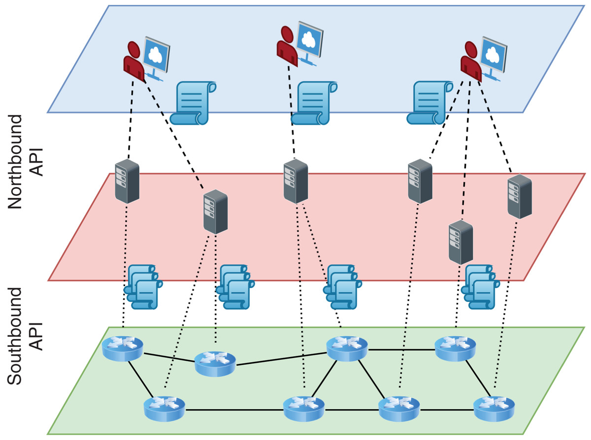

<a name="_page16_x0.00_y249.64"># Полное руководство по миграции на SDN SPRUT

В данном руководстве описаны причины и премущества миграции с SDN Neutron, на SDN Sprut. Приведены лучшие практики, типовые кейсы и способы миграции сервисов VK CLOUD.

- [Для чего нужна миграция](#_page0_x0.00_y451.12)
  - [Что такое sdn](#_page0_x0.00_y486.60)
  - [Чем sprut отличается от neutron](#_page0_x0.00_y575.74)
  - [Преимущества миграции](#_page1_x0.00_y408.15)
- [Сбор предварительных данных перед миграцией](#_page1_x0.00_y471.41)
- [Ограничения, к которым нужно быть готовым](#_page1_x0.00_y721.20)
  - [Смена плавающих ip](#_page2_x0.00_y81.64)
    - [Описание](#_page2_x0.00_y110.03)
    - [Решение](#_page2_x0.00_y175.46)
- [Как мигрировать](#_page2_x0.00_y236.66)
  - [IaaS](#_page2_x0.00_y348.52)
    - [Сети](#_page2_x0.00_y376.91)
      - [общая схема](#_page2_x0.00_y401.74)
      - [terraform](#_page6_x0.00_y226.61)
    - [Ipseс](#_page6_x0.00_y302.33)
    - [Балансировщики](#_page8_x0.00_y131.66)
    - [Виртуальные машины](#_page8_x0.00_y254.85)
      - [общая схема](#_page8_x0.00_y279.68)
    - [Подготовительные шаги.](#_page9_x0.00_y175.50)
      - [terraform](#_page14_x0.00_y459.86)
    - [NFS/CIFS](#_page16_x0.00_y129.53)
      - [общая схема](#_page16_x0.00_y154.35)
  - [PaaS](#_page16_x0.00_y249.64)
    - [Kubernetes](#_page17_x0.00_y232.09)
      - [общая схема](#_page17_x0.00_y256.91)
    - [DbaaS](#_page17_x0.00_y381.75)

---

# Для чего нужна миграция
## Что такое sdn
Software Defined Network — концепция выведения сетевых функций из специализированного железа на программный уровень и дальнейшего разделения ответственности на разные слои. SDN необходима для организации распределенной инфраструктуры на 1000+ серверов, быстрой миграции ресурсов внутри инфраструктуры и быстрого внесения изменений. SDN является инструментом управления оверлей-сетями и основой облачной инфраструктуры, обеспечивая маршрутизацию, firewall и сетевую связность между сервисами.

> test anno
Some Text. [^footnote]

[^footnote]: This is a footnote.
