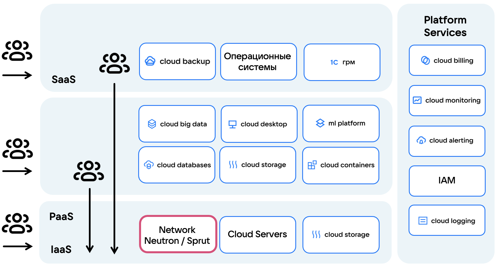
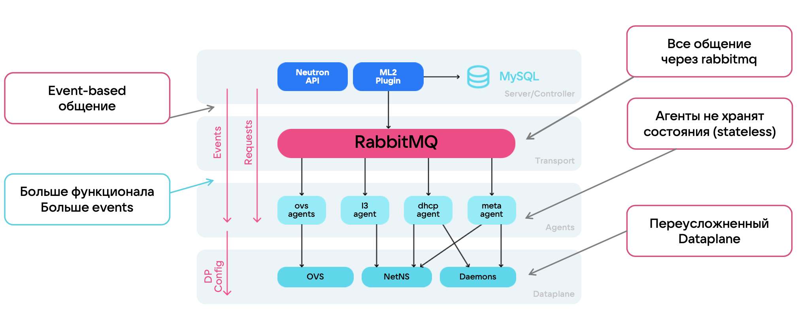
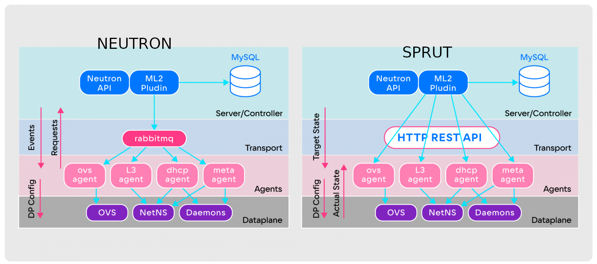

# Полное руководство по миграции на SDN SPRUT

В данном руководстве описаны причины и премущества миграции с SDN Neutron, на SDN Sprut. Приведены лучшие практики, типовые кейсы и способы миграции сервисов VK CLOUD.

- [Для чего нужна миграция](#для-чего-нужна-миграция)
  - [Что такое sdn](#_page0_x0.00_y486.60)
  - [Чем sprut отличается от neutron](#_page0_x0.00_y575.74)
  - [Преимущества миграции](#_page1_x0.00_y408.15)
- [Сбор предварительных данных перед миграцией](#_page1_x0.00_y471.41)
- [Ограничения, к которым нужно быть готовым](#_page1_x0.00_y721.20)
  - [Смена плавающих ip](#_page2_x0.00_y81.64)
    - [Описание](#_page2_x0.00_y110.03)
    - [Решение](#_page2_x0.00_y175.46)
- [Как мигрировать](#_page2_x0.00_y236.66)
  - [IaaS](#_page2_x0.00_y348.52)
    - [Сети](#_page2_x0.00_y376.91)
      - [общая схема](#_page2_x0.00_y401.74)
      - [terraform](#_page6_x0.00_y226.61)
    - [Ipseс](#_page6_x0.00_y302.33)
    - [Балансировщики](#_page8_x0.00_y131.66)
    - [Виртуальные машины](#_page8_x0.00_y254.85)
      - [общая схема](#_page8_x0.00_y279.68)
    - [Подготовительные шаги.](#_page9_x0.00_y175.50)
      - [terraform](#_page14_x0.00_y459.86)
    - [NFS/CIFS](#_page16_x0.00_y129.53)
      - [общая схема](#_page16_x0.00_y154.35)
  - [PaaS](#_page16_x0.00_y249.64)
    - [Kubernetes](#_page17_x0.00_y232.09)
      - [общая схема](#_page17_x0.00_y256.91)
    - [DbaaS](#_page17_x0.00_y381.75)

---

# Для чего нужна миграция
## Что такое sdn
Software Defined Network — концепция выведения сетевых функций из специализированного железа на программный уровень и дальнейшего разделения ответственности на разные слои. SDN необходима для организации распределенной инфраструктуры на 1000+ серверов, быстрой миграции ресурсов внутри инфраструктуры и быстрого внесения изменений. SDN является инструментом управления оверлей-сетями и основой облачной инфраструктуры, обеспечивая маршрутизацию, firewall и сетевую связность между сервисами.

*Software DefinedNetwork - Основа облачной инфраструктуры*

Сценарии использования SDN:
- Организация связности внутри проекта клиента
- Виртуальные роутеры, сети и подсети пользователя
- Доступ в Интернет, внешние подключения в проект клиента
- IP-address-менеджмент
- Настройка правил маршрутизации

Характеристики SDN:
- Пользователи продукта: end-users облака и вышестоящие продукты
- Высокие требования к надежности продукта
- Долгие этапы проработки и внедрения изменений

## Сравнение SDN Neutron и SDN Sprut
Neutron - это SDN, полностью интегрированный с платформой Openstack. Он предоставляет большой набор сетевых сервисов: виртуальные маршрутизаторы, балансировщики нагрузки, VPN, DNS, Security Group. Однако у Neutron есть ограничения по масштабируемости и добавлению новой функциональности.
Долгое время в VK Cloud использовался Neutron, но параллельно разрабатывалось собственное решение SDN Sprut, который решает проблемы в архитектуре Neutron, связанные с масштабируемостью и надёжностью.

На данной схеме предоставлена архитектура и схема работы обоих SDN. Подробнее в отдельной [статье](https://habr.com/ru/companies/vk/articles/763760/).

1. Для sprut агентов предусмотрена возможность постоянного сбора информации о настройках Data plane при помощи HTTP API.

   В neutron конфигурация доставляется при помощи очереди, без проверки что она действительно пришла. В случае ошибок в конфигурации необходима пересборка портов, то есть full sync, который занимает время. 

2. В sprut больше нет событийной модели общения между компонентами. Теперь агенты всегда получают от сервера целевое состояние, в котором должны быть, и непрерывно перезапрашивают его. Получился аналог постоянного Full Sync, при котором агенты сравнивают текущее состояние Data plane с целевым состоянием от сервера, накладывают необходимый diff на Data plane и приводят его к актуальному состоянию. В теории автоматического управления такой подход называют замкнутым контуром управления. 
2. RabbitMQ заменён обычным HTTP REST API. Он лучше справляется с большими массивами данных о таргетном состоянии агентов, его проще разрабатывать и мониторить. Пропала ещё одна потенциальная точка отказа.

> test anno
Some Text. [^footnote]

[^footnote]: This is a footnote.
