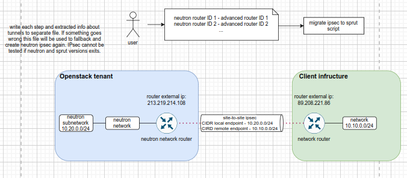
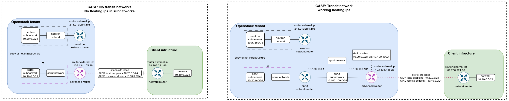
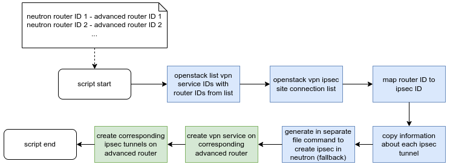

# COPY IPSEC SCRIPT



Ipsec tunnel in openstack consists of:
1. vpn tunnel
2.  IKE-policy (first phase)
3.  ipsec-policy (second phase)
4. 2 Endpoint groups
	1. Local address group
	2. Remote address group


**SCRIPT LOGIC**


**Commands in [[openstack cli]] to get information:**
## **vpn tunnel**
```bash
openstack vpn ipsec site connection list -f json
```
result:
```json
[
  {
    "ID": "b0a49e5b-513b-4000-b406-169ebe71c221", <-- id in gui
    "Name": "vpn_to_arch",
    "Peer Address": "89.208.221.86",
    "Authentication Algorithm": "psk",
    "Status": "ACTIVE"
  }
]
```

#### show more information:
```bash
openstack vpn ipsec site connection show b0a49e5b-513b-4000-b406-169ebe71c221 -f json
```
result:
```json
{
  "Authentication Algorithm": "psk",
  "DPD": {
    "action": "hold",
    "interval": 30,
    "timeout": 120
  },
  "Description": "",
  "ID": "b0a49e5b-513b-4000-b406-169ebe71c221",
  "IKE Policy": "973102bc-a3d4-4f59-94e5-ae8a4c2f7de8", <-- first phase
  "IPSec Policy": "c86fa495-0b45-48dd-ad52-d860c3700ff3", <-- second phase
  "Initiator": "bi-directional",
  "Local Endpoint Group ID": "9c92c392-cfd5-4a11-bcb3-dbcd32ddb9f8", <-- local endpoint group
  "Local ID": "",
  "MTU": 1500,
  "Name": "vpn_to_arch",
  "Peer Address": "89.208.221.86", <-- remote peer address
  "Peer CIDRs": [],
  "Peer Endpoint Group ID": "d996d1da-2ebd-47db-919e-7248bb33ec67", <-- remote group id
  "Peer ID": "89.208.221.86", <-- remote peer id
  "Pre-shared Key": "e98d^5nU8Nh0j0L6", <-- key for tunnel
  "Project": "5f44bfcdee6045249c9c839d1052077b",
  "Route Mode": "static",
  "State": true,
  "Status": "ACTIVE",
  "VPN Service": "f78bbebb-99ba-48d4-8944-8728050b41eb" <-- vpn service (find router there)
  allows to get router-id
}
```

## **ipsec-policy (second phase)**
```bash
openstack vpn ipsec policy list -f json
```
result:
```json
[
  {
    "ID": "c86fa495-0b45-48dd-ad52-d860c3700ff3",
    "Name": "vpn_to_arch",
    "Authentication Algorithm": "sha256",
    "Encapsulation Mode": "tunnel",
    "Transform Protocol": "esp",
    "Encryption Algorithm": "aes-256"
  }
]
```

#### show more information:
```bash
openstack vpn ipsec policy show c86fa495-0b45-48dd-ad52-d860c3700ff3 -f json
```
result:
```json
{
  "Authentication Algorithm": "sha256",
  "Description": "",
  "Encapsulation Mode": "tunnel",
  "Encryption Algorithm": "aes-256",
  "ID": "c86fa495-0b45-48dd-ad52-d860c3700ff3",
  "Lifetime": {
    "units": "seconds",
    "value": 3600
  },
  "Name": "vpn_to_arch",
  "Perfect Forward Secrecy (PFS)": "group14",
  "Project": "5f44bfcdee6045249c9c839d1052077b",
  "Transform Protocol": "esp"
}
```

## **IKE-policy (first phase)**
```bash
openstack vpn ike policy list -f json
```
result:
```json
[
  {
    "ID": "973102bc-a3d4-4f59-94e5-ae8a4c2f7de8",
    "Name": "vpn_to_arch",
    "Authentication Algorithm": "sha256",
    "Encryption Algorithm": "aes-256",
    "IKE Version": "v2",
    "Perfect Forward Secrecy (PFS)": "group14"
  }
]
```

#### show more information:
```bash
openstack vpn ike policy show 973102bc-a3d4-4f59-94e5-ae8a4c2f7de8 -f json
```
result:
```json
{
  "Authentication Algorithm": "sha256",
  "Description": "",
  "Encryption Algorithm": "aes-256",
  "ID": "973102bc-a3d4-4f59-94e5-ae8a4c2f7de8",
  "IKE Version": "v2",
  "Lifetime": {
    "units": "seconds",
    "value": 3600
  },
  "Name": "vpn_to_arch",
  "Perfect Forward Secrecy (PFS)": "group14",
  "Phase1 Negotiation Mode": "main",
  "Project": "5f44bfcdee6045249c9c839d1052077b"
}
```

## **endpoint groups**
```bash
openstack vpn endpoint group list -f json
```
result:
```json
[
  {
    "ID": "9c92c392-cfd5-4a11-bcb3-dbcd32ddb9f8",
    "Name": "vpn_to_arch",
    "Type": "subnet",
    "Endpoints": [
      "24449584-4037-4dc1-b717-0982f216782e"  <-- id of local subnet
    ]
  },
  {
    "ID": "d996d1da-2ebd-47db-919e-7248bb33ec67",
    "Name": "vpn_to_arch",
    "Type": "cidr",
    "Endpoints": [
      "10.10.0.0/24" <-- remote network (remote group)
    ]
  }
]
```

#### show more information:
```bash
openstack vpn endpoint group show 9c92c392-cfd5-4a11-bcb3-dbcd32ddb9f8 -f json
```
result: 
```json
{
  "Description": "",
  "Endpoints": [
    "24449584-4037-4dc1-b717-0982f216782e" <-- id of local subnet
  ],
  "ID": "9c92c392-cfd5-4a11-bcb3-dbcd32ddb9f8",
  "Name": "vpn_to_arch",
  "Project": "5f44bfcdee6045249c9c839d1052077b",
  "Type": "subnet",
  "sdn": "neutron"
}

```

show endpoint subnet:
```bash
openstack subnet show 24449584-4037-4dc1-b717-0982f216782e -f json
```
result:
```json
{
  "allocation_pools": [
    {
      "start": "10.20.0.2",
      "end": "10.20.0.254"
    }
  ],
  "cidr": "10.20.0.0/24",
  "created_at": "2024-07-19T20:59:21Z",
  "description": "",
  "dns_nameservers": [],
  "dns_publish_fixed_ip": null,
  "enable_dhcp": true,
  "gateway_ip": "10.20.0.1",
  "host_routes": [],
  "id": "24449584-4037-4dc1-b717-0982f216782e", <-- id of subnet
  "ip_version": 4,
  "ipv6_address_mode": null,
  "ipv6_ra_mode": null,
  "name": "vpn_subnet_neutron", <-- name of subnet
  "network_id": "26c087fd-e2ed-4aaa-8cba-d0779b6e1ac4", <-- id of network
  "project_id": "5f44bfcdee6045249c9c839d1052077b",
  "revision_number": 2,
  "sdn": "neutron", <-- sdn name
  "segment_id": null,
  "service_types": [],
  "subnetpool_id": null,
  "tags": [],
  "tenant_id": "5f44bfcdee6045249c9c839d1052077b",
  "updated_at": "2024-07-19T20:59:21Z"
}
```

second
```bash
openstack vpn endpoint group show d996d1da-2ebd-47db-919e-7248bb33ec67 -f json
```
result:
```json
{
  "Description": "",
  "Endpoints": [
    "10.10.0.0/24"
  ],
  "ID": "d996d1da-2ebd-47db-919e-7248bb33ec67",
  "Name": "vpn_to_arch",
  "Project": "5f44bfcdee6045249c9c839d1052077b",
  "Type": "cidr",
  "sdn": "neutron"
}
```
## **vpn service**
```bash
openstack vpn service list -f json
```
result:
```json
[
  {
    "ID": "f78bbebb-99ba-48d4-8944-8728050b41eb",
    "Name": "",
    "Router": "b18f6adb-6d17-4ae2-976e-47047d46f176",
    "Subnet": null,
    "Flavor": "",
    "State": true,
    "Status": "ACTIVE"
  }
]
```

#### show more information:
```bash
openstack vpn service show f78bbebb-99ba-48d4-8944-8728050b41eb -f json
```
result:
```json
{
  "Description": "",
  "Flavor": "",
  "ID": "f78bbebb-99ba-48d4-8944-8728050b41eb",
  "Name": "",
  "Project": "5f44bfcdee6045249c9c839d1052077b",
  "Router": "b18f6adb-6d17-4ae2-976e-47047d46f176", <-- router id
  "State": true,
  "Status": "ACTIVE",
  "Subnet": null,
  "sdn": "neutron"
}
```

router list:
```shell
openstack router list -f json
```
result:
```json
[
  {
    "ID": "031b9dc7-d0a5-4baa-a1b5-a87dbb4024c1",
    "Name": "router_4236",
    "Status": "ACTIVE",
    "State": true,
    "Project": "5f44bfcdee6045249c9c839d1052077b"
  },
  {
    "ID": "b18f6adb-6d17-4ae2-976e-47047d46f176",
    "Name": "vpn_router_neutron",
    "Status": "ACTIVE",
    "State": true,
    "Project": "5f44bfcdee6045249c9c839d1052077b"
  }
]
```

## Chain of queries

#### Collecting data

**find vpn service ID by given router ID:**
```shell
openstack vpn service list -f json | jq -c  \
--arg routerid "b18f6adb-6d17-4ae2-976e-47047d46f176" '.[] | select(.Router == $routerid) | .ID'
```

```shell
"f78bbebb-99ba-48d4-8944-8728050b41eb"
```

**get all ipsec ids in project:**
```bash
openstack vpn ipsec site connection list -f json | jq .[].ID
```

```shell
"b0a49e5b-513b-4000-b406-169ebe71c221"
```

**show information about ipsec for each id:**
```
openstack vpn ipsec site connection show b0a49e5b-513b-4000-b406-169ebe71c221 -f json | jq  '."VPN Service"'
```

```bash
openstack vpn ipsec site connection show b0a49e5b-513b-4000-b406-169ebe71c221 -f json | jq -c --arg vpnserviceid "f78bbebb-99ba-48d4-8944-8728050b41eb"  '. | select(."VPN Service" == $vpnserviceid)' | jq '."ID",."IKE Policy",."IPSec Policy",."Local Endpoint Group ID",."Peer Endpoint Group ID",."Pre-shared Key",."Peer ID"'
```
If there is no vpn with given vpnserviceid output will be empty

If there vpn exists output will be
```bash
"b0a49e5b-513b-4000-b406-169ebe71c221" <-- id of vpn tunnel
"973102bc-a3d4-4f59-94e5-ae8a4c2f7de8" <--id of ike policy
"c86fa495-0b45-48dd-ad52-d860c3700ff3" <-- id of ipsec policy
"9c92c392-cfd5-4a11-bcb3-dbcd32ddb9f8" <-- local endpoint group
"d996d1da-2ebd-47db-919e-7248bb33ec67" < -- remote endpoint group
"e98d^5nU8Nh0j0L6" < -- Preshared key
"89.208.221.86" < -- remote peer ip
```

**show information about ike policy:**
```bash
openstack vpn ike policy show "973102bc-a3d4-4f59-94e5-ae8a4c2f7de8" -f json
```

```json
{
  "Authentication Algorithm": "sha256",
  "Description": "",
  "Encryption Algorithm": "aes-256",
  "ID": "973102bc-a3d4-4f59-94e5-ae8a4c2f7de8",
  "IKE Version": "v2",
  "Lifetime": {
    "units": "seconds",
    "value": 3600
  },
  "Name": "vpn_to_arch",
  "Perfect Forward Secrecy (PFS)": "group14",
  "Phase1 Negotiation Mode": "main",
  "Project": "5f44bfcdee6045249c9c839d1052077b"
}
```

**show information about ipsec policy:**
```bash
openstack vpn ipsec policy show "c86fa495-0b45-48dd-ad52-d860c3700ff3" -f json
```

```json
{
  "Authentication Algorithm": "sha256",
  "Description": "",
  "Encapsulation Mode": "tunnel",
  "Encryption Algorithm": "aes-256",
  "ID": "c86fa495-0b45-48dd-ad52-d860c3700ff3",
  "Lifetime": {
    "units": "seconds",
    "value": 3600
  },
  "Name": "vpn_to_arch",
  "Perfect Forward Secrecy (PFS)": "group14",
  "Project": "5f44bfcdee6045249c9c839d1052077b",
  "Transform Protocol": "esp"
}
```

**show information about local endpoint group:**
```bash
openstack vpn endpoint group show "9c92c392-cfd5-4a11-bcb3-dbcd32ddb9f8" -f json
```

```json
{
  "Description": "",
  "Endpoints": [
    "24449584-4037-4dc1-b717-0982f216782e"
  ],
  "ID": "9c92c392-cfd5-4a11-bcb3-dbcd32ddb9f8",
  "Name": "vpn_to_arch",
  "Project": "5f44bfcdee6045249c9c839d1052077b",
  "Type": "subnet",
  "sdn": "neutron"
}
```

**show information about subnets on router:**
```shell
openstack router show b18f6adb-6d17-4ae2-976e-47047d46f176 -f json | jq '."interfaces_info"' | jq '.[].subnet_id' | uniq
```

```json
"24449584-4037-4dc1-b717-0982f216782e"
```

**find corresponding to neutron (same network address) same sprut network:**
```bash
openstack subnet list -f json | jq -c \
--arg neutronsubneaddress "10.20.0.0/24" --arg neutronsubnetuuid "24449584-4037-4dc1-b717-0982f216782e" '.[] | select((.Subnet == $neutronsubneaddress) and (.ID != $neutronsubnetuuid))'
```

```json
{
   "ID":"365db8d0-359a-41fd-8898-94a2f447af9c",
   "Name":"vpn_subnet-sprut",
   "Network":"8e70740f-2dd5-47ca-ba80-ed2b9d2e153c",
   "Subnet":"10.20.0.0/24"
}
```
we need name for output and ID

**find remote group network address:**
second
```bash
openstack vpn endpoint group show d996d1da-2ebd-47db-919e-7248bb33ec67 \
-f json | jq .Endpoints
```
result:
```json
{
  "Description": "",
  "Endpoints": [
    "10.10.0.0/24"
  ],
  "ID": "d996d1da-2ebd-47db-919e-7248bb33ec67",
  "Name": "vpn_to_arch",
  "Project": "5f44bfcdee6045249c9c839d1052077b",
  "Type": "cidr",
  "sdn": "neutron"
}
```

#### Creating copy of a tunnel
Because we use different sdn and different type of router [[advanced router (vkcloud)]]

**Create VPN Service**
```bash
local token=$(openstack token issue -c id -f value)
local url="https://infra.mail.ru:9696/v2.0/vpn/vpnservices"
local routerid="c8339b98-24d1-4b6e-bdbc-c56eb38bae53"
local data=$(cat <<EOF
{
"vpnservice": {
  "router_id": "$routerid",
  "name": "",
  "admin_state_up": true
  }
}
EOF
    )

curl -s -X POST $url \
-H "Content-Type: application/json" \
-H "X-Auth-Token: $token" \
-H "X-SDN: SPRUT" \
-d "$data"
```

**Create IPSec policy**
```bash
local token=$(openstack token issue -c id -f value)
local url="https://infra.mail.ru:9696/v2.0/vpn/ipsecpolicies"
local data=$(cat <<EOF
{
	"ipsecpolicy": {
	  "name": "rx_ipsec_policy",
	  "transform_protocol": "esp",
	  "auth_algorithm": "sha256",
	  "encapsulation_mode": "tunnel",
	  "encryption_algorithm": "aes-256",
	  "pfs": "group14",
	  "lifetime": {
		"units": "seconds",
		"value": 7200
	  }
	}
}
EOF
)

curl -s -X POST $url \
-H "Content-Type: application/json" \
-H "X-Auth-Token: $token" \
-H "X-SDN: SPRUT" \
-d "$data"
```

**Create IKE policy**

```bash
local token=$(openstack token issue -c id -f value)
local url="https://infra.mail.ru:9696/v2.0/vpn/ikepolicies"
local data=$(cat <<EOF
{
"ikepolicy": {
  "phase1_negotiation_mode": "main",
  "auth_algorithm": "sha256",
  "encryption_algorithm": "aes-256",
  "pfs": "group14",
  "lifetime": {
    "units": "seconds",
    "value": 14400
    },
  "ike_version": "v2",
  "name": "rx_ikev2_policy"
  }
}
EOF
)

curl -s -X POST $url \
-H "Content-Type: application/json" \
-H "X-Auth-Token: $token" \
-H "X-SDN: SPRUT" \
-d "$data"
```

**Create Local group**

```json
{
  "endpoint_group": {
  "endpoints": [
    "10.56.0.0/29"
  ],
  "type": "cidr",
  "name": "adv_left"
  }
}
```

**Create Remote Group**
```json
{
  "endpoint_group": {
  "endpoints": [
    "192.168.5.0/24"
  ],
  "type": "cidr",
  "name": "adv_right"
  }
}
```

Create IPSec tunnel
```json
{
	"ipsec_site_connection": {
		"psk": "rGSIXvz3GYpkhzDKwkxjmGzew",
		"initiator": "bi-directional",
		"ipsecpolicy_id": "e1434e60-d798-4c91-92ef-25ab09b21846",
		"admin_state_up": true,
		"mtu": "1500",
		"peer_ep_group_id": "4891199f-6910-4084-9b69-588a46c750fe",
		"ikepolicy_id": "4edc70fa-763f-4950-be26-383f31cc45dc",
		"vpnservice_id": "784943d4-6c89-47ce-a584-d2f5b5c4f861",
		"local_ep_group_id": "1721cc0e-7d18-42a8-8335-94f2dd78d280",
		"peer_address": "62.176.10.113",
		"peer_id": "62.176.10.113",
		"name": "adv-ipsec-conn-1"
	}
}
```

## Test cases

#### basic scenario

**project: ilya-nyrkov-demo-stand**
vm: test-vpn-subnet-1
subnet: vpn_subnet_neutron
ip: 10.20.0.25
router: vpn_router_neutron
router ip: 213.219.214.108
vpn-name: vpn_to_arch
sdn: neutron
   |
 (vpn)
  \\|/
**project: arch-main**
vm: test-vpn-subnet-2
subnet: vpn_subnet_neutron
ip: 10.10.0.17
router: vpn_router_neutron
router ip: 89.208.221.86
vpn-name: vpn_to_ilya
sdn: neutron


replace in **project: ilya-nyrkov-demo-stand**


**project: ilya-nyrkov-demo-stand**
vm: test-vpn-subnet-sprut-1"
subnet: vpn_subnet-sprut
ip: 10.20.0.97
advanced router: vpn_router-sprut
advanced router ip: 212.111.84.166
vpn-name: vpn_to_arch
sdn: neutron


