# Миграция IPsec на sprut

Для построения IPSec туннеля используются следующие компоненты 
1. ipsec connection
2. IKE-policy (first phase)
3. ipsec-policy (second phase)
4. 2 Endpoint groups
	1. Local address group - адреса сетей vpn на стороне vkcloud
	2. Remote address group - адреса сетей vpn на стороне инфраструктуры клиента

## Схема данных
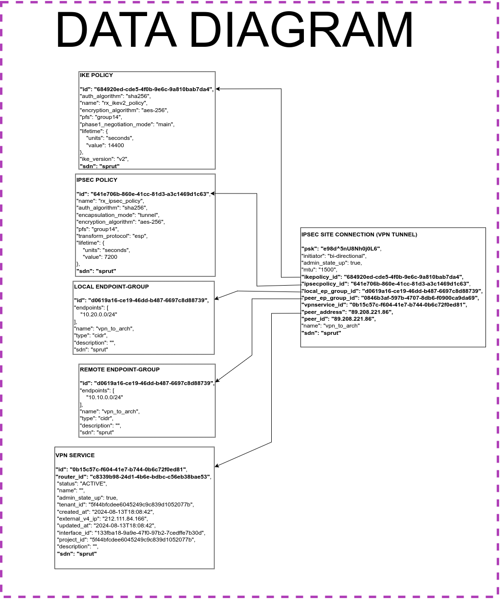


## Миграция при помощи скрипта

Для миграции ipsec туннелей написан скрипт [copy-ipsec-v2.sh](../../copy-ipsec-v2.sh). Он копирует конфигурации туннелей на neutron и создаёт аналогичные на sprut.

### Алгоритм работы скрипта: 
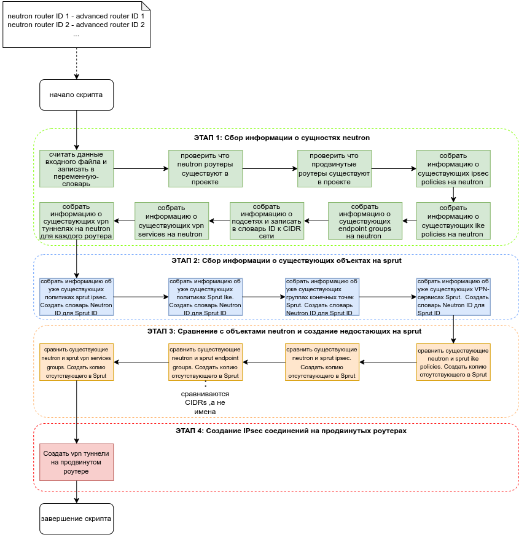

### Алгоритм работы со скриптом:

#### Шаг 0

Имеется исходная сетевая инфраструктура:
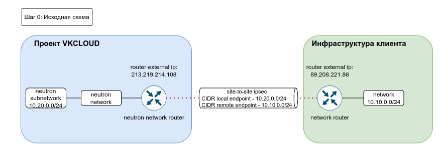

#### Шаг 1

Перед переносом ipsec необходимо создать аналогичную сетевую инфраструктуру на sprut. 
Для автоматического копирования сетевой инфраструктуры можно воспользоваться [скриптом](../scripts/copy-router-and-networks.md).

Здесь есть два варианта: 1) без транзитной сети 2) через транзитную сеть

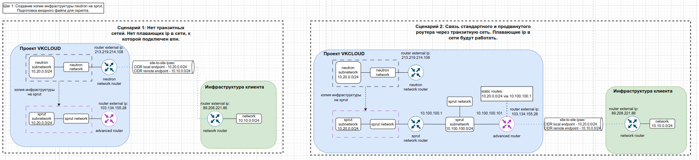

**ВАЖНО!** На sprut для построения ipsec необходимо использовать [продвинутый роутер](https://cloud.vk.com/docs/ru/networks/vnet/how-to-guides/advanced-router), в отличии от neutron, где используется стандартный.

**ВАЖНО!** Продвинутый роутер не поддерживает плавающие ip, только [DNAT](https://cloud.vk.com/docs/ru/networks/vnet/service-management/advanced-router/manage-dnat). Для сохранения функционала на sprut необходимо реализовать схему с транзитной сетью.

**ВАЖНО!** В vpn туннелях на neutron нельзя использовать одновременно плавающий ip и обращаться к сетям за vpn через один интерфейс ввиду специфики работы default gateway. На sprut через схему с транзитной сетью можно добиться работы данного сценария.

**ВАЖНО!** На продвинутом роутере должен быть назначен внешний ip.
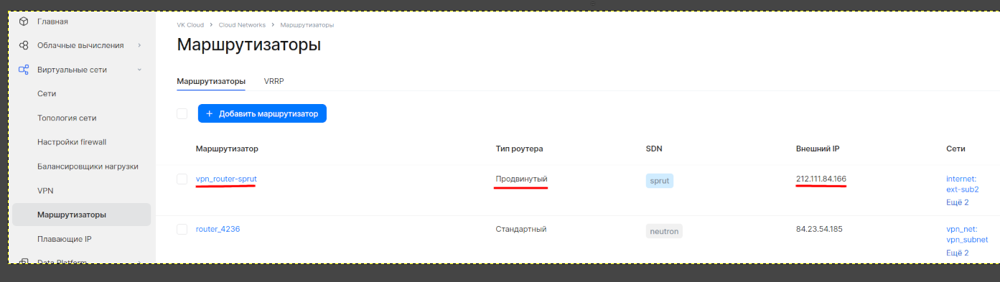

В случае отсутствия внешнего ip, необходимо зайти в описание маршрутизатора -> "Интерфейсы"
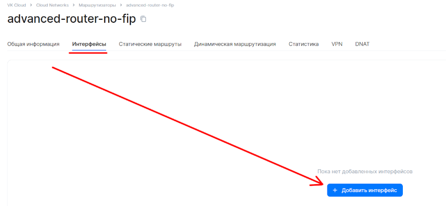


В списке выбираем любую внешную подсеть sprut и добавляем интерфейс. Полученный адрес будет новым адресом пира на стороне клиента.
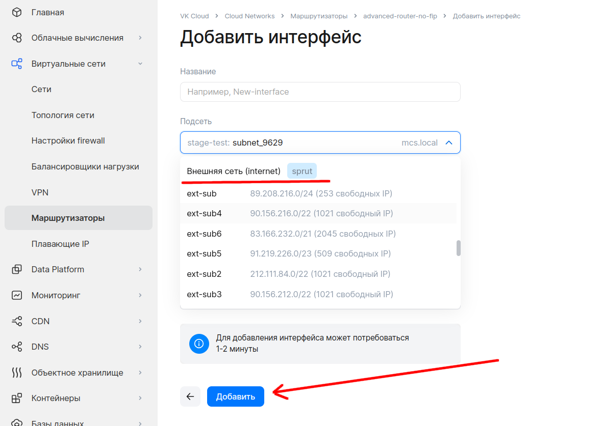

#### Шаг 2
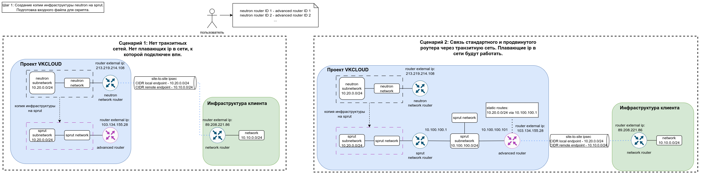

Необходимо подготовить конфиг файл для скрипта.

формат конфига:
```shell
<ID стандартного роутера, с которого нужно перенести ipsec>,<ID продвинутого роутера, на который нужно перенести ipsec>
```

Все туннели со стандартного ротуера будут скопированы на продвинутый.

#### Шаг 3

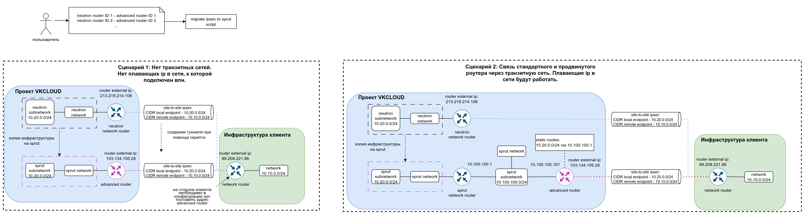


Для запуска необходимо выполнить команду:
```bash
./copy-ipsec-v2.sh config.csv
```

В результате выполнения скрипта будут описаны все шаги (приведённые в алгоритме выше). В конце должны быть успешные запросы на создание ipsec туннелей в sprut.

```shell
STAGE 3 complete: Missing Sprut objects created
**********************************************************************************
{====================STAGE 4: Creating IPsec Site Connections in Sprut====================}
Processing IPsec site connection ID: b0a49e5b-513b-4000-b406-169ebe71c221
IPsec site connection details:
{
  "Authentication Algorithm": "psk",
  "DPD": {
    "action": "hold",
    "interval": 30,
    "timeout": 120
  },
  "Description": "",
  "ID": "b0a49e5b-513b-4000-b406-169ebe71c221",
  "IKE Policy": "973102bc-a3d4-4f59-94e5-ae8a4c2f7de8",
  "IPSec Policy": "c86fa495-0b45-48dd-ad52-d860c3700ff3",
  "Initiator": "bi-directional",
  "Local Endpoint Group ID": "9c92c392-cfd5-4a11-bcb3-dbcd32ddb9f8",
  "Local ID": "",
  "MTU": 1500,
  "Name": "vpn_to_arch",
  "Peer Address": "89.208.221.86",
  "Peer CIDRs": [],
  "Peer Endpoint Group ID": "d996d1da-2ebd-47db-919e-7248bb33ec67",
  "Peer ID": "89.208.221.86",
  "Pre-shared Key": "e98d^5nU8Nh0j0L6",
  "Project": "5f44bfcdee6045249c9c839d1052077b",
  "Route Mode": "static",
  "State": true,
  "Status": "DOWN",
  "VPN Service": "f78bbebb-99ba-48d4-8944-8728050b41eb"
}
Creating IPsec site connection 'vpn_to_arch' in Sprut
Executing curl command with request body:
{
  "ipsec_site_connection": {
    "psk": "e98d^5nU8Nh0j0L6",
    "initiator": "bi-directional",
    "ipsecpolicy_id": "487251af-f372-4982-be9e-03a730b2ca57",
    "admin_state_up": "true",
    "mtu": "1500",
    "peer_ep_group_id": "ee657779-4223-4984-8b67-7da6b2e9b665",
    "ikepolicy_id": "10b21728-bac3-4b34-b19d-ba8d594d90f6",
    "vpnservice_id": "9d25573e-f1d2-42f6-b475-b363ebd0661d",
    "local_ep_group_id": "f721d62e-42c1-4a65-a1d8-9fd66b1dd8e5",
    "peer_address": "89.208.221.86",
    "peer_id": "89.208.221.86",
    "name": "vpn_to_arch"
  }
}
Curl response:
{"ipsec_site_connection":{"updated_at":"2024-08-16T19:53:06","ikepolicy_id":"10b21728-bac3-4b34-b19d-ba8d594d90f6","vpnservice_id":"9d25573e-f1d2-42f6-b475-b363ebd0661d","local_ep_group_id":"f721d62e-42c1-4a65-a1d8-9fd66b1dd8e5","peer_address":"89.208.221.86","id":"459eb3dc-23bf-4034-b08f-7f5717c11d1e","traffic_selector_ep_merge":true,"route_mode":"static","ipsecpolicy_id":"487251af-f372-4982-be9e-03a730b2ca57","peer_id":"89.208.221.86","status":"ACTIVE","psk":"e98d^5nU8Nh0j0L6","description":"","auth_mode":"psk","initiator":"bi-directional","project_id":"5f44bfcdee6045249c9c839d1052077b","name":"vpn_to_arch","admin_state_up":true,"tenant_id":"5f44bfcdee6045249c9c839d1052077b","created_at":"2024-08-16T19:53:06","mtu":1500,"peer_ep_group_id":"ee657779-4223-4984-8b67-7da6b2e9b665","dpd":{"action":"hold","interval":30,"timeout":120},"sdn":"sprut"}}
STAGE 4 complete: IPsec site connections created in Sprut
**********************************************************************************
```

**ВАЖНО!** После переноса туннелей при помощи скрипта, необходимо обновить конфигурацию туннеля на стороне инфраструктуры клиента в том числе.

**ВАЖНО!** На момент написания инструкции [17 августа 02:00] нет возможности переносить адрес внешнего ip со стандартного роутера neutron на продвинутый, поэтому адрес пира в конфигурации vpn туннеля со стороны клиента нужно будет изменить.

#### Шаг 4

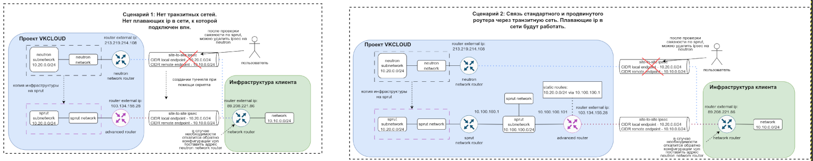

**ВАЖНО!** Для проверки работоспобности туннеля после переноса на sprut не обязательно удалять исходный туннель на neutron, главное заменить адрес пира в конфигурации vpn на стороне клиента с внешнего ip нейтрон роутера на внешний ip продвинутого роутера.

После проверки работоспособности можно удалить туннель на neutron.

## Terraform

В случае, если идёт управление через terraform, мигрированный туннель можно импортировать:

1. [ipsec connection](https://github.com/vk-cs/terraform-provider-vkcs/blob/master/docs/resources/vpnaas_site_connection.md)
```bash
terraform import vkcs_vpnaas_site_connection.conn_1 <UUID сущности>
```
2. [IKE-policy](https://github.com/vk-cs/terraform-provider-vkcs/blob/master/docs/resources/vpnaas_ike_policy.md)
```bash
terraform import vkcs_vpnaas_ike_policy.policy_1 <UUID сущности>
```
3. [ipsec-policy (second phase)](https://github.com/vk-cs/terraform-provider-vkcs/blob/master/docs/resources/vpnaas_ipsec_policy.md)
```bash
terraform import vkcs_vpnaas_ipsec_policy.policy_1 <UUID сущности>
```
4. [Endpoint groups](https://github.com/vk-cs/terraform-provider-vkcs/blob/master/docs/resources/vpnaas_endpoint_group.md)
```bash
terraform import <UUID сущности>
```

и сгенерировать для него код:

```c++
import {
 to = <тип ресурса>.<название ресурса>  
 id = “<id сервиса в облаке>”
}
```
Таким же образом можно выполнить копирование туннеля, сгенерировав код для neutron туннеля (если его нет) и дальше задать параметр для каждого компонента sdn=sprut.

В основе данного функционала используется блок import в terraform. 
- Значение to это название сервиса, код для описания которого нужно сгенерировать
- Значение id это openstack id, который можно посмотреть GET запросом в апи. Дополнительно необходимы заголовки X-SDN:sprut и X-Auth-Token:<токен openstack cli, можно получить командой **openstack token issue -c id -f value**>

https://infra.mail.ru:9696/v2.0/vpn/endpoint-groups

https://infra.mail.ru:9696/v2.0/vpn/ipsec-site-connections

https://infra.mail.ru:9696/v2.0/vpn/ikepolicies

https://infra.mail.ru:9696/v2.0/vpn/ipsecpolicies

https://infra.mail.ru:9696/v2.0/vpn/vpnservices

* Перед указанием блока import в коде, рекомендуется сделать бэкап конфиг файлов terraform, куда планируется вносить эти блоки, также рекомендуется сделать бэкап state файла терраформ.
Далее необходимо выполнить команду terraform plan, чтобы убедится что состояние актуально, перед выполнением операций import. Данный вывод показывает, что состояние ресурсов в облаке синхронизировано с кодом terraform:

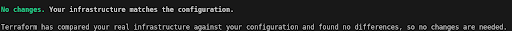

* После проверки состояния, можно вносить в конфиг файл terraform блоки import, правильные типы ресурсов можно посмотреть здесь, название ресурса можно указать любое. На странице описания каждого ресурса в документации имеется пример как выполнить import данного типа ресурса.
* После внесения всех блоков import в конфиг файл terraform необходимо выполнить команду:
```bash
terraform plan -generate-config-out=<имя .tf файла, в котором будет сгенерированы описания ресурсов из import блоков>
```

Данный код можно скопировать из файла в другой файл, например main.tf, или оставить в так, в отдельном файле.
* Выполняем 
```bash
terraform plan
```
чтобы посмотреть изменения в инфраструктуре, которые возникнут, если мы применим конфигурацию с новым сгенерированным файлом.

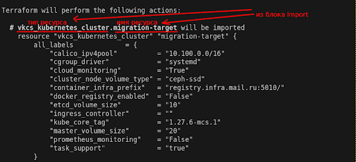

* В выводе указано will be imported - это означает, что данный ресурс не будет создан, он просто будет занесен в state файл terraform для дальнейшего управления уже через terraform.
* В конце вывода, после перечисления всех ресурсов указано количество импортируемых объектов, объектов которые будут добавлены и удалены должно быть 0, так как блок import никак не должен менять состояние инфраструктуры в облаке. 

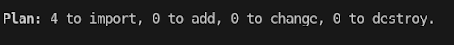

* Если 
```bash
terraform plan 
```
показал правильный вывод, можно выполнить 

```bash
terraform apply
```

после чего будет обновлён state file и появится возможность редактировать конфигурацию импортированного ресурса.
* Можно проверить возможность редактирования, за счёт изменения описания ресурса в конфиг файле terraform. Проверить, что terraform не пересоздаст ресурс можно также через terraform plan.
