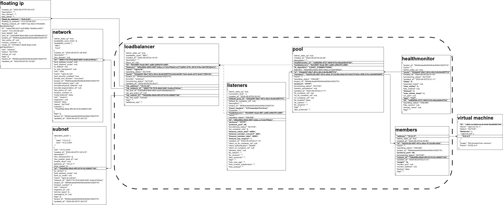
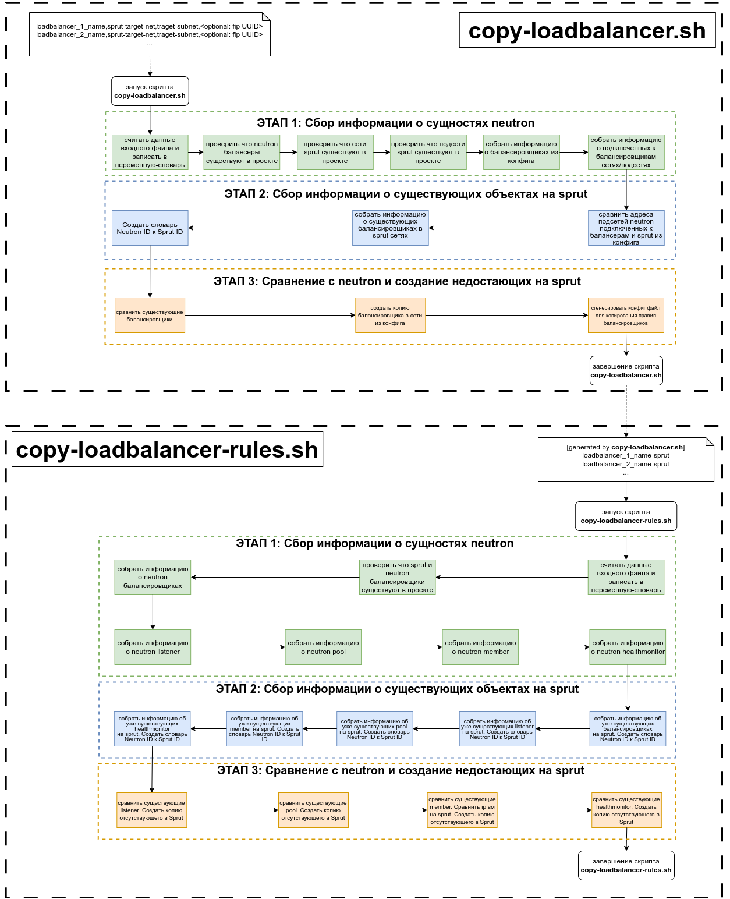
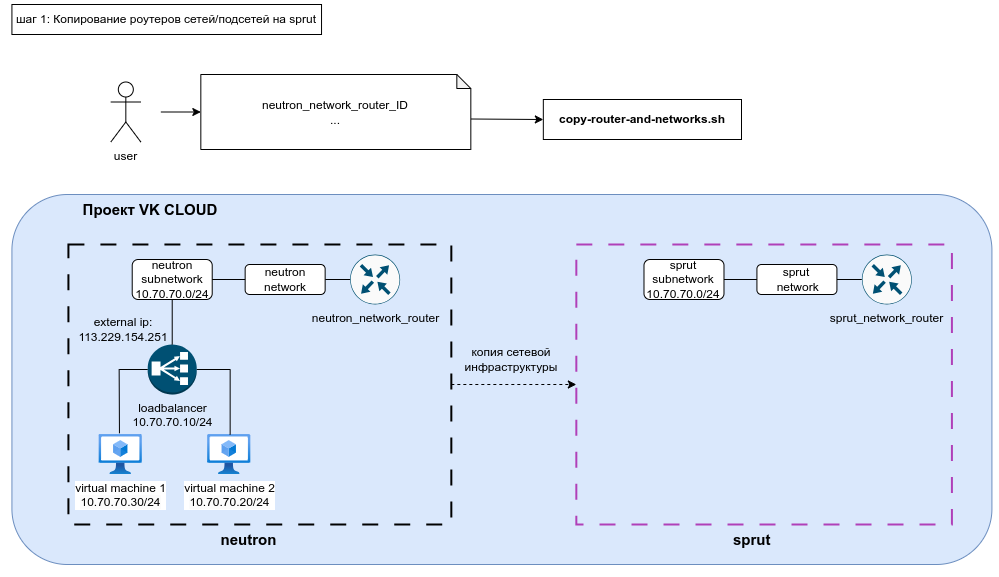
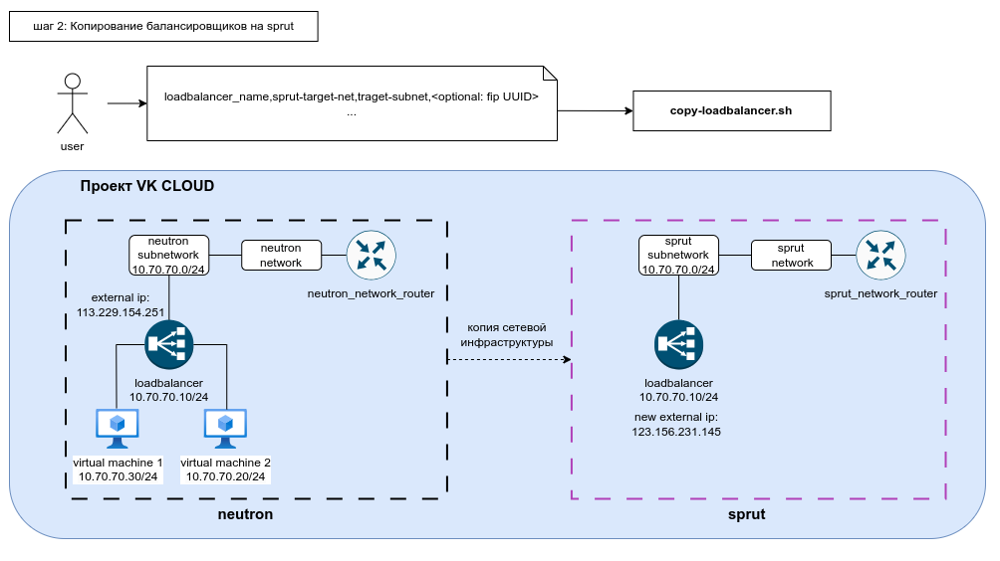
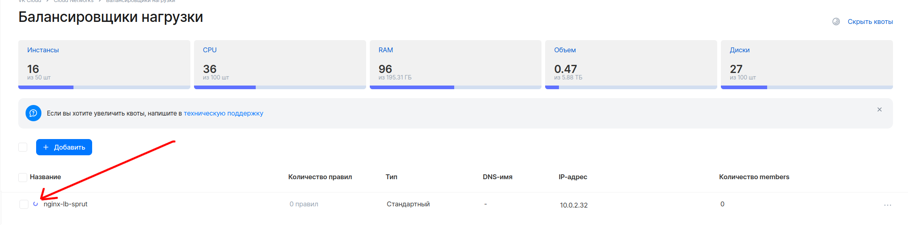
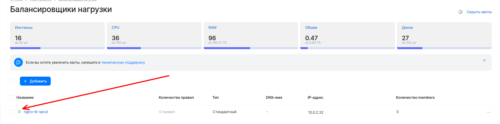
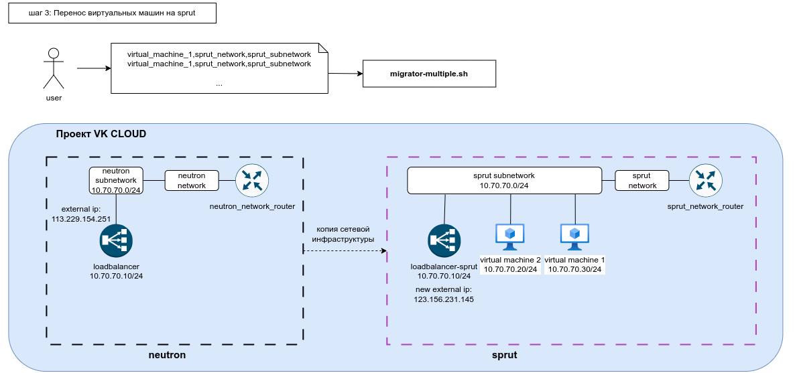
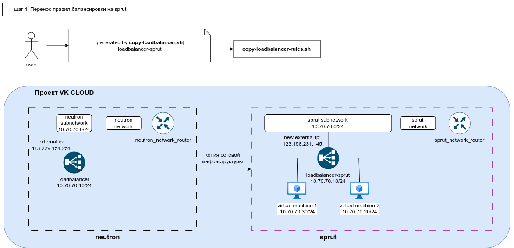

# Миграция балансировщиков нагрузки

Балансировщик и его правила состоят из следующих сущностей:
1. Балансировщик
1. listener
1. pool
1. healthmonitor
1. members

### Схема данных

На данной схеме изображены пример json описания каждого объекта и связей между ними, который может копировать скрипт. 
В контуре указаны сущности балансировщика, за контуром зависимые сущности.


Для вывода подробной информации о конкретном экземпляре сущности какого-то типа используется команда **show**.

(Для вывода в формате json необходимо после list добавить **-f json**)

### Loadbalancer

```bash
openstack loadbalancer show nginx-lb -f json
```

```json
{
  "admin_state_up": true,
  "availability_zone": "ME1",
  "created_at": "2024-08-20T22:18:18",
  "description": "",
  "flavor_id": null,
  "id": "9233f697-9aa8-4f61-ad85-a5f4d761c888",
  "listeners": "d0be060a-6922-4807-bdba-cc7a3a795a0c\na77a6963-d75c-4819-918a-b947803dbd1a",
  "name": "nginx-lb",
  "operating_status": "ERROR",
  "pools": "03dabf47-00e7-401e-92c3-8e36c69f7f7d\nb5ed2458-72eb-4ae8-a272-0a4e7155913b",
  "project_id": "5f44bfcdee6045249c9c839d1052077b",
  "provider": "amphora",
  "provisioning_status": "ACTIVE",
  "updated_at": "2024-08-20T22:29:21",
  "vip_address": "10.0.2.32",
  "vip_network_id": "df401718-7918-4bb5-9401-fcd4cd1943ac",
  "vip_port_id": "a302a809-f6e6-480c-ba34-983afb4dd7c2",
  "vip_qos_policy_id": null,
  "vip_subnet_id": "7b0e958a-90e8-4ff3-8318-f2c3080977d6",
  "vip_vnic_type": "normal",
  "tags": "",
  "additional_vips": ""
}
```

### Listeners

```bash
openstack loadbalancer listener show d0be060a-6922-4807-bdba-cc7a3a795a0c -f json
```

```json
{
  "admin_state_up": true,
  "connection_limit": -1,
  "created_at": "2024-08-20T22:20:34",
  "default_pool_id": "03dabf47-00e7-401e-92c3-8e36c69f7f7d",
  "default_tls_container_ref": null,
  "description": "",
  "id": "d0be060a-6922-4807-bdba-cc7a3a795a0c",
  "insert_headers": "X-Forwarded-For=true",
  "l7policies": "",
  "loadbalancers": "9233f697-9aa8-4f61-ad85-a5f4d761c888",
  "name": "",
  "operating_status": "ONLINE",
  "project_id": "5f44bfcdee6045249c9c839d1052077b",
  "protocol": "HTTP",
  "protocol_port": 80,
  "provisioning_status": "ACTIVE",
  "sni_container_refs": [],
  "timeout_client_data": 40001,
  "timeout_member_connect": 4001,
  "timeout_member_data": 40001,
  "timeout_tcp_inspect": 1,
  "updated_at": "2024-08-20T22:21:12",
  "client_ca_tls_container_ref": null,
  "client_authentication": "NONE",
  "client_crl_container_ref": null,
  "allowed_cidrs": null,
  "tls_ciphers": "",
  "tls_versions": "",
  "alpn_protocols": "",
  "tags": "",
  "hsts_max_age": "",
  "hsts_include_subdomains": "",
  "hsts_preload": ""
}
```

### Pools

```bash
openstack loadbalancer pool show 03dabf47-00e7-401e-92c3-8e36c69f7f7d -f json
```

```json
{
  "admin_state_up": true,
  "created_at": "2024-08-20T22:20:48",
  "description": "",
  "healthmonitor_id": "ed80259e-6727-4845-915a-68aa9d0e576d",
  "id": "03dabf47-00e7-401e-92c3-8e36c69f7f7d",
  "lb_algorithm": "LEAST_CONNECTIONS",
  "listeners": "d0be060a-6922-4807-bdba-cc7a3a795a0c",
  "loadbalancers": "9233f697-9aa8-4f61-ad85-a5f4d761c888",
  "members": "0a243c26-e667-4d1a-a4ee-47cdcd8ca5ab\n67a44a79-824e-40f9-b7b4-afb480548ff5",
  "name": "",
  "operating_status": "ONLINE",
  "project_id": "5f44bfcdee6045249c9c839d1052077b",
  "protocol": "HTTP",
  "provisioning_status": "ACTIVE",
  "session_persistence": null,
  "updated_at": "2024-08-20T22:21:11",
  "tls_container_ref": null,
  "ca_tls_container_ref": null,
  "crl_container_ref": null,
  "tls_enabled": false,
  "tls_ciphers": "",
  "tls_versions": "",
  "tags": "",
  "alpn_protocols": ""
}
```

### Member

```bash
openstack loadbalancer member show 03dabf47-00e7-401e-92c3-8e36c69f7f7d 0a243c26-e667-4d1a-a4ee-47cdcd8ca5ab -f json
```

```json
{
  "address": "10.0.2.5",
  "admin_state_up": true,
  "created_at": "2024-08-20T22:20:56",
  "id": "0a243c26-e667-4d1a-a4ee-47cdcd8ca5ab",
  "name": "",
  "operating_status": "ONLINE",
  "project_id": "5f44bfcdee6045249c9c839d1052077b",
  "protocol_port": 80,
  "provisioning_status": "ACTIVE",
  "subnet_id": "7b0e958a-90e8-4ff3-8318-f2c3080977d6",
  "updated_at": "2024-08-20T22:21:21",
  "weight": 10,
  "monitor_port": null,
  "monitor_address": null,
  "backup": false,
  "tags": ""
}
```

### Healthmonitor

```bash
openstack loadbalancer healthmonitor show ed80259e-6727-4845-915a-68aa9d0e576d -f json
```

```json
{
  "project_id": "5f44bfcdee6045249c9c839d1052077b",
  "name": "",
  "admin_state_up": true,
  "pools": "03dabf47-00e7-401e-92c3-8e36c69f7f7d",
  "created_at": "2024-08-20T22:21:10",
  "provisioning_status": "ACTIVE",
  "updated_at": "2024-08-20T22:21:11",
  "delay": 6,
  "expected_codes": null,
  "max_retries": 4,
  "http_method": null,
  "timeout": 3,
  "max_retries_down": 3,
  "url_path": null,
  "type": "TCP",
  "id": "ed80259e-6727-4845-915a-68aa9d0e576d",
  "operating_status": "ONLINE",
  "http_version": null,
  "domain_name": null,
  "tags": ""
}
```

### Миграция при помощи скриптов

Для миграции балансировщиков написан скрипт [copy-loadbalancer.sh](../../copy-loadbalancer.sh). Этот скрипт не требует изменения целевой инфраструктуры, поэтому техокно не нужно.

Для миграции правил балансировки написан скрипт [copy-loadbalancer-rules.sh](../../copy-loadbalancer-rules.sh). Для данного скрипта требуется техническое окно, так как виртуальные машины, которые ранее были на neutron вместе с балансировщиком, должны быть перенесены уже на sprut. 
Виртуальные машины можно перенести при помощи скрипта [migrator-multiple.sh](../../migrator-multiple.sh). [Инструкция по скрипту](../scripts/migrator-multiple.md). 

Базовый сценарий миграции виртуальной машины описан в [инструкции на главной странице](../../readme.md).

### Алгоритм работы скриптов


### Шаг 0

Имеется исходная сетевая инфраструктура с виртуальными машинами и балансировщиками:


### Шаг 1


Необходимо скопировать сетевую инфраструктуру на sprut, для этого можно воспользоваться скриптом.[copy-router-and-networks.sh](./copy-router-and-networks.md)

### Шаг 2

**ВАЖНО!** На момент написания инструкции (22 августа 2024) нет возможности переносить плавающие (внешние) ip между neutron и sprut, поэтому при использовании внешнего ip для балансировщика, нужно быть готовым что он изменится после миграции.

**ВАЖНО!** Создание копии балансировщика в sprut сети никак не затрагивает работоспособность исходной инфраструктуры, поэтому для запуска скрипта [copy-loadbalancer.sh](../../copy-loadbalancer.sh) не нужно техническое окно. Техническое окно понадобится на следующих шагах при переносе виртуальных машин и правил балансировки.
 


У балансировщиков openstack octavia нельзя изменить сеть подключения, поэтому создадим копию балансировщика в аналогичной сети на sprut.

Для этого воспользуемся скиптом [copy-loadbalancer.sh](../../copy-loadbalancer.sh).

Формат конфиг файла для скрипта **config.csv**:
```shell
<имя балансировщика в сети neutron 1>,<сеть sprut>,<подсеть sprut>,<опционально: id плавающего ip на спрут>
<имя балансировщика в сети neutron 2>,<сеть sprut>,<подсеть sprut>,<опционально: id плавающего ip на спрут>
...
```

Для запуска скрипта выполняем команду:

```bash
./copy-loadbalancer.sh config.csv
```

В результате работы скрипта, будет создан новый конфиг файл: **copy-loadbalancer-script-output-config.csv**. Данный файл будет использоваться скриптом [copy-loadbalancer-rules.sh](../../copy-loadbalancer-rules.sh) для копирования правил балансировки.

Перед выполнением миграции нужно дождаться чтобы балансировщики создались.





### Шаг 3

**ВАЖНО!** Для данного шага уже понадобится техническое окно, так как переключение портов у виртуальных машин подразумевает временную потерю сетевой связности.

**ВАЖНО!** После миграции виртуальных машин НЕ УДАЛЯЙТЕ исходный балансировщик. Данные для него понадобится для следующего скрипта + в случае чего можно будет откатиться обратно.



Мигрируем виртуальные машины при помощи скрипта [migrator-multiple.sh](../../migrator-multiple.sh).

[Инструкция по скрипту](../scripts/migrator-multiple.md). 

Базовый сценарий миграции виртуальной машины описан в [инструкции на главной странице](../../readme.md).

### Шаг 4

**ВАЖНО!** Для данного шага также требуется техническое окно, так как назначение правил балансировки занимает некоторое время, без правил балансировщик не будет направлять трафик в виртуальные машины.



**ВАЖНО!** Для данного шага нам понадобится файл **copy-loadbalancer-script-output-config.csv**, сгенерированный на 2 шаге скриптом [copy-loadbalancer.sh](../../copy-loadbalancer.sh). Его мы подаём на вход скрипту [copy-loadbalancer-rules.sh](../../copy-loadbalancer-rules.sh).

Для запуска скрипта выполняем команду:

```bash
./copy-loadbalancer.sh copy-loadbalancer-script-output-config.csv
```

Пример успешного вывода на последней стадии
```bash
STAGE 3: Create missing entities in Sprut
Copying neutron listener d0be060a-6922-4807-bdba-cc7a3a795a0c
Creating listener for Sprut load balancer 16b06a34-801b-4648-88f4-d5e66eb6ceca
Running API request: POST https://public.infra.mail.ru:9876/v2/lbaas/listeners
Request body: {
  "listener": {
    "name": "nginx-lb-sprut_listener_HTTP_80",
    "protocol": "HTTP",
    "protocol_port": "80",
    "description": "",
    "loadbalancer_id": "16b06a34-801b-4648-88f4-d5e66eb6ceca"
  }
}
Request response: {"listener": {"client_ca_tls_container_ref": null, "protocol": "HTTP", "default_tls_container_ref": null, "updated_at": null, "default_pool_id": null, "id": "bfce98e9-7804-4fc0-9ba6-a3dca2057bc9", "insert_headers": {}, "loadbalancers": [{"id": "16b06a34-801b-4648-88f4-d5e66eb6ceca"}], "sni_container_refs": [], "timeout_member_connect": 5000, "client_crl_container_ref": null, "project_id": "5f44bfcdee6045249c9c839d1052077b", "operating_status": "OFFLINE", "allowed_cidrs": null, "description": "", "provisioning_status": "PENDING_CREATE", "timeout_member_data": 50000, "protocol_port": 80, "tags": [], "timeout_tcp_inspect": 0, "name": "nginx-lb-sprut_listener_HTTP_80", "admin_state_up": true, "client_authentication": "NONE", "created_at": "2024-08-25T22:54:48", "timeout_client_data": 50000, "connection_limit": -1, "tenant_id": "5f44bfcdee6045249c9c839d1052077b", "l7policies": []}}
Sprut listener ID: bfce98e9-7804-4fc0-9ba6-a3dca2057bc9
Creating pool for Sprut listener bfce98e9-7804-4fc0-9ba6-a3dca2057bc9
Running API request: POST https://public.infra.mail.ru:9876/v2/lbaas/pools
Request body: {
  "pool": {
    "name": "bfce98e9-7804-4fc0-9ba6-a3dca2057bc9_pool_HTTP_LEAST_CONNECTIONS",
    "protocol": "HTTP",
    "lb_algorithm": "LEAST_CONNECTIONS",
    "listener_id": "bfce98e9-7804-4fc0-9ba6-a3dca2057bc9"
  }
}
Request response: {"pool": {"lb_algorithm": "LEAST_CONNECTIONS", "protocol": "HTTP", "updated_at": null, "id": "4eb1541c-d5c9-4027-bb4d-6e00fb89e5ef", "loadbalancers": [{"id": "16b06a34-801b-4648-88f4-d5e66eb6ceca"}], "tags": [], "project_id": "5f44bfcdee6045249c9c839d1052077b", "operating_status": "OFFLINE", "tls_container_ref": null, "description": "", "provisioning_status": "PENDING_CREATE", "members": [], "shutdown_sessions": false, "ca_tls_container_ref": null, "name": "bfce98e9-7804-4fc0-9ba6-a3dca2057bc9_pool_HTTP_LEAST_CONNECTIONS", "admin_state_up": true, "allbackups": true, "tenant_id": "5f44bfcdee6045249c9c839d1052077b", "created_at": "2024-08-25T22:54:59", "tls_enabled": false, "session_persistence": null, "listeners": [{"id": "bfce98e9-7804-4fc0-9ba6-a3dca2057bc9"}], "crl_container_ref": null}}
Sprut pool ID: 4eb1541c-d5c9-4027-bb4d-6e00fb89e5ef
Creating member for Sprut pool 4eb1541c-d5c9-4027-bb4d-6e00fb89e5ef
Running API request: POST https://public.infra.mail.ru:9876/v2/lbaas/pools/4eb1541c-d5c9-4027-bb4d-6e00fb89e5ef/members
Request body: {
  "member": {
    "name": "4eb1541c-d5c9-4027-bb4d-6e00fb89e5ef_member_10.0.2.5_80",
    "address": "10.0.2.5",
    "protocol_port": "80",
    "subnet_id": "66a86f0f-5dce-4dd3-a2aa-3ad1eb6dbc73",
    "weight": "10"
  }
}
Request response: {"member": {"monitor_port": null, "project_id": "5f44bfcdee6045249c9c839d1052077b", "name": "4eb1541c-d5c9-4027-bb4d-6e00fb89e5ef_member_10.0.2.5_80", "weight": 10, "admin_state_up": true, "subnet_id": "66a86f0f-5dce-4dd3-a2aa-3ad1eb6dbc73", "tenant_id": "5f44bfcdee6045249c9c839d1052077b", "created_at": "2024-08-25T22:55:05", "provisioning_status": "PENDING_CREATE", "monitor_address": null, "updated_at": null, "tags": [], "address": "10.0.2.5", "protocol_port": 80, "backup": false, "id": "6baf19c4-cd63-4065-a1f9-76d8343f48fc", "operating_status": "NO_MONITOR"}}
Sprut member ID: 6baf19c4-cd63-4065-a1f9-76d8343f48fc
Creating member for Sprut pool 4eb1541c-d5c9-4027-bb4d-6e00fb89e5ef
Running API request: POST https://public.infra.mail.ru:9876/v2/lbaas/pools/4eb1541c-d5c9-4027-bb4d-6e00fb89e5ef/members
Request body: {
  "member": {
    "name": "4eb1541c-d5c9-4027-bb4d-6e00fb89e5ef_member_10.0.2.8_80",
    "address": "10.0.2.8",
    "protocol_port": "80",
    "subnet_id": "66a86f0f-5dce-4dd3-a2aa-3ad1eb6dbc73",
    "weight": "10"
  }
}
Request response: {"member": {"monitor_port": null, "project_id": "5f44bfcdee6045249c9c839d1052077b", "name": "4eb1541c-d5c9-4027-bb4d-6e00fb89e5ef_member_10.0.2.8_80", "weight": 10, "admin_state_up": true, "subnet_id": "66a86f0f-5dce-4dd3-a2aa-3ad1eb6dbc73", "tenant_id": "5f44bfcdee6045249c9c839d1052077b", "created_at": "2024-08-25T22:55:11", "provisioning_status": "PENDING_CREATE", "monitor_address": null, "updated_at": null, "tags": [], "address": "10.0.2.8", "protocol_port": 80, "backup": false, "id": "ccc3c3bc-701a-4f05-8e7d-5cecd373c46f", "operating_status": "NO_MONITOR"}}
Sprut member ID: ccc3c3bc-701a-4f05-8e7d-5cecd373c46f
Creating health monitor for Sprut pool 4eb1541c-d5c9-4027-bb4d-6e00fb89e5ef
Running API request: POST https://public.infra.mail.ru:9876/v2/lbaas/healthmonitors
Request body: {
  "healthmonitor": {
    "delay": "6",
    "timeout": "3",
    "max_retries": "4",
    "type": "TCP",
    "pool_id": "4eb1541c-d5c9-4027-bb4d-6e00fb89e5ef",
    "name": "4eb1541c-d5c9-4027-bb4d-6e00fb89e5ef_monitor_TCP_6"
  }
}
Request response: {"healthmonitor": {"tenant_id": "5f44bfcdee6045249c9c839d1052077b", "project_id": "5f44bfcdee6045249c9c839d1052077b", "name": "4eb1541c-d5c9-4027-bb4d-6e00fb89e5ef_monitor_TCP_6", "admin_state_up": true, "pools": [{"id": "4eb1541c-d5c9-4027-bb4d-6e00fb89e5ef"}], "created_at": "2024-08-25T22:55:22", "provisioning_status": "PENDING_CREATE", "updated_at": null, "domain_name": null, "delay": 6, "expected_codes": null, "max_retries": 4, "http_method": null, "timeout": 3, "http_version": null, "max_retries_down": 3, "tags": [], "url_path": null, "type": "TCP", "id": "5638c402-6d07-4dc3-9b73-aa42fc577695", "operating_status": "OFFLINE"}}
Sprut health monitor ID: 5638c402-6d07-4dc3-9b73-aa42fc577695
Load balancer rules copy process completed.
```

### Шаг 5

Проверяем работоспособность балансировщиков, отправляя необходимые запросы в приложения. После успешной проверки исходные балансировщики на neutron можно удалить.

