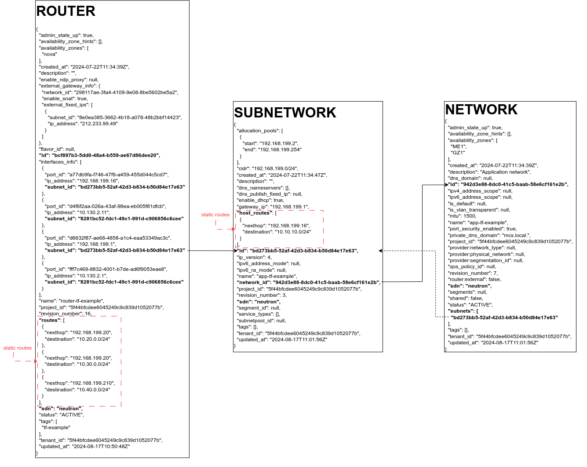
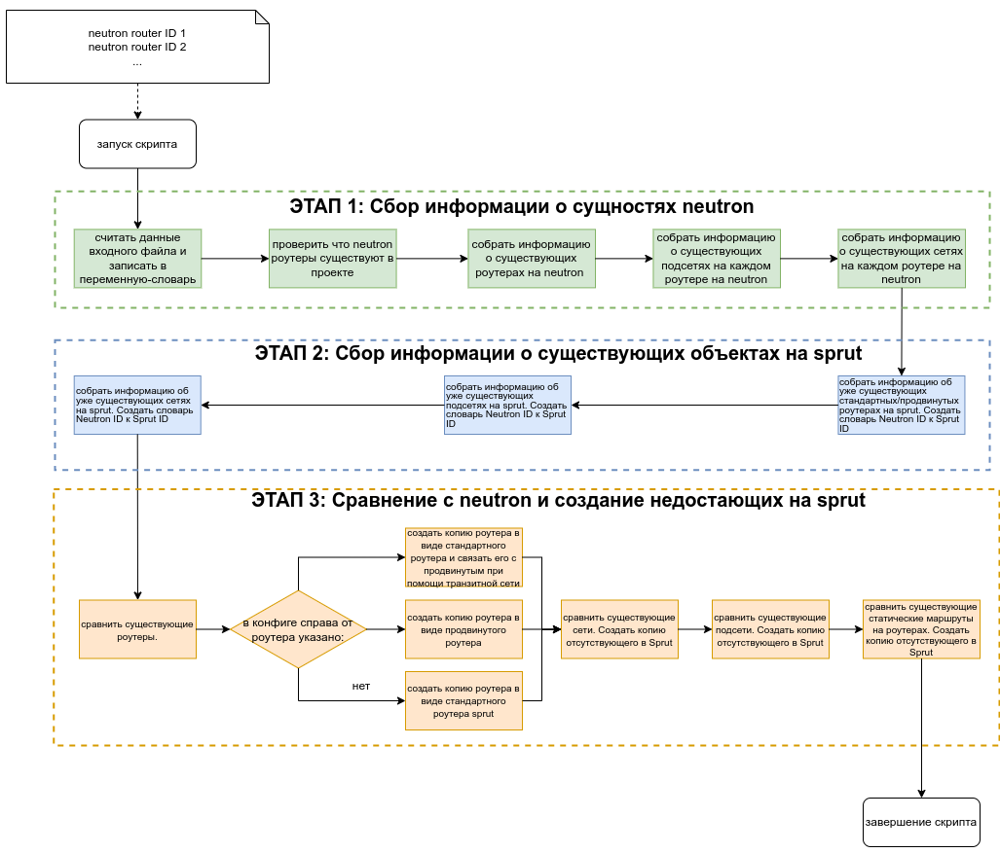
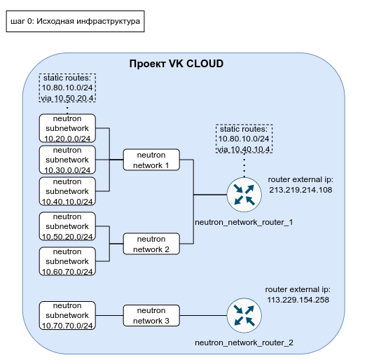
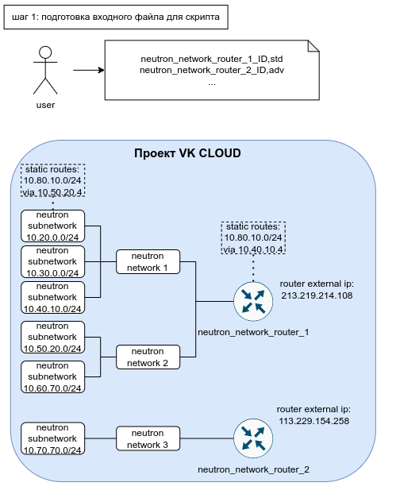

# Миграция роутеров и сетей на sprut

Сетевая инфраструктура строится на следующих сущностях:

1. Платформенные роутеры
1. Статические маршруты на платформенных роутерах
1. Сети
1. Подсети
1. Статические маршруты в подсетях

## Схема данных

На данной схеме изображены пример json описания каждого объекта и связей между ними, который может копировать скрипт.


Для вывода списка сущностей какого-то типа используется команда **list**.
Для вывода подробной информации о конкретном экземпляре сущности какого-то типа используется команда **show**.

(Для вывода в формате json необходимо после list добавить **-f json**)

### Router

```bash
openstack router list
```

```shell
+--------------------------------------+-------------------------+--------+-------+----------------------------------+
| ID                                   | Name                    | Status | State | Project                          |
+--------------------------------------+-------------------------+--------+-------+----------------------------------+
| 64970cf2-c79a-41b3-b1d6-1af8a38421fa | router-tf-example-sprut | ACTIVE | UP    | 5f44bfcdee6045249c9c839d1052077b |
| c8bce62b-aff7-46a6-9cc1-57c6296a152c | standard-sprut-router   | ACTIVE | UP    | 5f44bfcdee6045249c9c839d1052077b |
+--------------------------------------+-------------------------+--------+-------+----------------------------------+
```

```bash
openstack router show c8bce62b-aff7-46a6-9cc1-57c6296a152c -f json
```

```json
{
  "admin_state_up": true,
  "availability_zone_hints": null,
  "availability_zones": null,
  "created_at": "2024-08-17T13:08:52",
  "description": "",
  "enable_ndp_proxy": null,
  "external_gateway_info": {
    "network_id": "ec8c610e-6387-447e-83d2-d2c541e88164",
    "enable_snat": true,
    "external_fixed_ips": [
      {
        "subnet_id": "4bb55beb-0650-4d60-a3a0-8a38210440d7",
        "ip_address": "90.156.219.163"
      }
    ]
  },
  "flavor_id": null,
  "id": "c8bce62b-aff7-46a6-9cc1-57c6296a152c",
  "interfaces_info": [
    {
      "port_id": "de157b3c-acc8-4837-b574-4f32f37b366b",
      "ip_address": "10.0.0.1",
      "subnet_id": "f078ccef-7d1a-40eb-8266-1a0f6d23fed6"
    }
  ],
  "name": "standard-sprut-router",
  "project_id": "5f44bfcdee6045249c9c839d1052077b",
  "revision_number": null,
  "routes": [],
  "sdn": "sprut",
  "status": "ACTIVE",
  "tags": [],
  "tenant_id": "5f44bfcdee6045249c9c839d1052077b",
  "updated_at": "2024-08-17T13:08:55"
}
```

В interfaces info

```json
"interfaces_info": [
    {
      "port_id": "de157b3c-acc8-4837-b574-4f32f37b366b",
      "ip_address": "10.0.0.1",
      "subnet_id": "f078ccef-7d1a-40eb-8266-1a0f6d23fed6"
    }
  ]
```

Можно посмотреть список подключений роутеров к сетям.

### Port

```bash
openstack port show de157b3c-acc8-4837-b574-4f32f37b366b -f json
```
```json
{
  "admin_state_up": true,
  "allowed_address_pairs": [],
  "binding_host_id": null,
  "binding_profile": {},
  "binding_vif_details": {},
  "binding_vif_type": null,
  "binding_vnic_type": "normal",
  "created_at": "2024-08-17T13:09:57",
  "data_plane_status": null,
  "description": "",
  "device_id": "c8bce62b-aff7-46a6-9cc1-57c6296a152c",
  "device_owner": "network:router_interface",
  "device_profile": null,
  "dns_assignment": null,
  "dns_domain": null,
  "dns_name": "",
  "extra_dhcp_opts": [],
  "fixed_ips": [
    {
      "subnet_id": "f078ccef-7d1a-40eb-8266-1a0f6d23fed6",
      "ip_address": "10.0.0.1"
    }
  ],
  "hardware_offload_type": null,
  "id": "de157b3c-acc8-4837-b574-4f32f37b366b",
  "ip_allocation": null,
  "mac_address": "fa:16:3e:4a:18:b3",
  "name": "",
  "network_id": "86e003ef-55e8-4b0b-8ed8-0e1315e5189b",
  "numa_affinity_policy": null,
  "port_security_enabled": false,
  "project_id": "5f44bfcdee6045249c9c839d1052077b",
  "propagate_uplink_status": null,
  "qos_network_policy_id": null,
  "qos_policy_id": null,
  "resource_request": null,
  "revision_number": null,
  "sdn": "sprut",
  "security_group_ids": [],
  "status": "ACTIVE",
  "tags": [],
  "tenant_id": "5f44bfcdee6045249c9c839d1052077b",
  "trunk_details": null,
  "updated_at": "2024-08-17T13:09:57"
}

```

```bash
openstack port list -f json
```
```json
[
  {
    "ID": "3700ea96-054d-4bf3-911d-69cf98857548",
    "Name": "",
    "MAC Address": "fa:16:3e:c4:a4:af",
    "Fixed IP Addresses": [
      {
        "subnet_id": "c1d65953-d73f-47b7-a839-aec6da62434c",
        "ip_address": "10.130.2.129"
      }
    ],
    "Status": "DOWN"
  },
  {
    "ID": "42ce527f-b8ae-4ab8-95d3-e0543e928dc2",
    "Name": "router-tf-example-app-tf-example-sprut",
    "MAC Address": "fa:16:3e:a9:9c:35",
    "Fixed IP Addresses": [
      {
        "subnet_id": "38bc98d0-bce4-4648-8241-5979f2594fbf",
        "ip_address": "192.168.199.16"
      }
    ],
    "Status": "ACTIVE"
  }
]
```


### Network

```bash
openstack network list -f json
```

```json
[
  {
    "ID": "17d7e5a9-275f-4af2-b2f1-92cbee5933ed",
    "Name": "vpn_net",
    "Subnets": [
      "19c7a800-f97a-4f48-ab19-dd3c7a805362"
    ]
  },
  {
    "ID": "16c1e303-4fad-4b76-8e61-1ceb67cc7d15",
    "Name": "stage-test",
    "Subnets": [
      "060339a9-b69f-4852-8145-d34e2ba0f373"
    ]
  }
]
```

```bash
openstack network show 16c1e303-4fad-4b76-8e61-1ceb67cc7d15 -f json
```

```json
{
  "admin_state_up": true,
  "availability_zone_hints": [],
  "availability_zones": [
    "nova"
  ],
  "created_at": "2024-03-12T07:00:15Z",
  "description": "",
  "dns_domain": null,
  "id": "16c1e303-4fad-4b76-8e61-1ceb67cc7d15",
  "ipv4_address_scope": null,
  "ipv6_address_scope": null,
  "is_default": null,
  "is_vlan_transparent": null,
  "mtu": 1500,
  "name": "stage-test",
  "port_security_enabled": true,
  "private_dns_domain": "mcs.local.",
  "project_id": "5f44bfcdee6045249c9c839d1052077b",
  "provider:network_type": null,
  "provider:physical_network": null,
  "provider:segmentation_id": null,
  "qos_policy_id": null,
  "revision_number": 6,
  "router:external": false,
  "sdn": "neutron",
  "segments": null,
  "shared": false,
  "status": "ACTIVE",
  "subnets": [
    "060339a9-b69f-4852-8145-d34e2ba0f373"
  ],
  "tags": [],
  "tenant_id": "5f44bfcdee6045249c9c839d1052077b",
  "updated_at": "2024-03-12T07:00:16Z"
}
```

### Subnetwork

```bash
 openstack subnet list -f json
```
```json
[
  {
    "ID": "1c623b92-146c-46a6-9ffd-fa69eb2239b7",
    "Name": "ext-sub",
    "Network": "ec8c610e-6387-447e-83d2-d2c541e88164",
    "Subnet": "89.208.216.0/24"
  },
  {
    "ID": "365db8d0-359a-41fd-8898-94a2f447af9c",
    "Name": "vpn_subnet-sprut",
    "Network": "8e70740f-2dd5-47ca-ba80-ed2b9d2e153c",
    "Subnet": "10.20.0.0/24"
  }
]
```

```bash
openstack subnet show 1c623b92-146c-46a6-9ffd-fa69eb2239b7 -f json
```
```json
{
  "allocation_pools": [
    {
      "start": "89.208.216.1",
      "end": "89.208.216.253"
    }
  ],
  "cidr": "89.208.216.0/24",
  "created_at": "2022-01-17T16:30:40",
  "description": "",
  "dhcp_ip": null,
  "dns_ip": null,
  "dns_nameservers": [
    "5.61.237.120",
    "5.61.237.127"
  ],
  "dns_publish_fixed_ip": null,
  "enable_dhcp": false,
  "enable_private_dns": false,
  "gateway_ip": "89.208.216.254",
  "host_routes": [],
  "id": "1c623b92-146c-46a6-9ffd-fa69eb2239b7",
  "ip_version": 4,
  "ipv6_address_mode": null,
  "ipv6_ra_mode": null,
  "name": "ext-sub",
  "network_id": "ec8c610e-6387-447e-83d2-d2c541e88164",
  "project_id": "9d013ed7c41e4bf38dd91f899e40185a",
  "revision_number": null,
  "sdn": "sprut",
  "segment_id": null,
  "service_types": null,
  "subnetpool_id": null,
  "tags": [],
  "tenant_id": "9d013ed7c41e4bf38dd91f899e40185a",
  "updated_at": "2024-01-24T07:33:35"
}
```

## Миграция при помощи скрипта

Для миграции роутеров и подключенных к нему сетей/подсетей написан скрипт [copy-router-and-networks.sh](../../copy-router-and-networks.sh). Он принимает копирует конфигурации роутеров и подключенных к роутеру сетей/подсетей на neutron и создаёт аналогичные на sprut.

### Алгоритм работы скрипта: 



## Шаг 0: Исходная сетевая инфраструктура

Имеется исходная сетевая инфраструктура на neutron:


Состоящая из роутеров, сетей и подсетей.

## Шаг 1: Подготовка конфиг файла



Необходимо подготовить конфиг файл для скрипта.

формат конфига:
```shell
<ID стандартного роутера 1, который будет скопирован вместе с подключенным к нему сетями>,<std|adv>
<ID стандартного роутера 2, который будет скопирован вместе с подключенным к нему сетями>,<std|adv>
```

Указываем одно из этих значений рядом с айди каждого роутера
```shell
<std|adv>
```
* В случае std копия будет в виде стандартного sprut роутера
* В случае adv копия будет в виде [продвинутого роутера](https://cloud.vk.com/docs/ru/networks/vnet/how-to-guides/advanced-router)

ID роутера можно получить через личный кабинет облака или команду:

```bash
openstack router list
```

```shell
+--------------------------------------+-------------------------+--------+-------+----------------------------------+
| ID                                   | Name                    | Status | State | Project                          |
+--------------------------------------+-------------------------+--------+-------+----------------------------------+
| 64970cf2-c79a-41b3-b1d6-1af8a38421fa | router-tf-example-sprut | ACTIVE | UP    | 5f44bfcdee6045249c9c839d1052077b |
| c8bce62b-aff7-46a6-9cc1-57c6296a152c | standard-sprut-router   | ACTIVE | UP    | 5f44bfcdee6045249c9c839d1052077b |
+--------------------------------------+-------------------------+--------+-------+----------------------------------+
```

## Шаг 2: Запуск скрипта


**!ВАЖНО** В sprut роутерах нет SNAT портов, поэтому надобность в статических маршрутах на уровне подсетей с ними пропадает.

Для запуска необходимо выполнить команду:

```bash
./copy-router-and-networks.sh config.csv
```

В результате выполнения скрипта будут описаны все шаги (приведённые в алгоритме выше). В конце должны быть успешные запросы на создание ресурсов в sprut.

Пример вывода стадии создания sprut роутеров сетей и подсете.
```shell
{====================STAGE 3: Comparing and Creating Missing Objects in Sprut====================}
Creating Router 'router-tf-example-sprut' in Sprut
{
  "router": {
    "status": "ACTIVE",
    "name": "router-tf-example-sprut",
    "admin_state_up": true,
    "tenant_id": "5f44bfcdee6045249c9c839d1052077b",
    "created_at": "2024-08-18T23:20:54",
    "tags": [],
    "updated_at": "2024-08-18T23:20:54",
    "routes": [],
    "project_id": "5f44bfcdee6045249c9c839d1052077b",
    "id": "64970cf2-c79a-41b3-b1d6-1af8a38421fa",
    "description": "",
    "sdn": "sprut"
  }
}
==================================================================================
Neutron to Sprut Routers
==================================================================================
| Neutron Router ID                    | Sprut Router ID                      |
 ̅ ̅ ̅ ̅ ̅ ̅ ̅ ̅ ̅ ̅ ̅ ̅ ̅ ̅ ̅ ̅ ̅ ̅ ̅ ̅ ̅ ̅ ̅ ̅ ̅ ̅ ̅ ̅ ̅ ̅ ̅ ̅ ̅ ̅ ̅ ̅ ̅ ̅ ̅ ̅ ̅ ̅ ̅ ̅ ̅ ̅ ̅ ̅ ̅ ̅ ̅ ̅ ̅ ̅ ̅ ̅ ̅ ̅ ̅ ̅ ̅ ̅ ̅ ̅ ̅ ̅ ̅ ̅ ̅ ̅ ̅ ̅ ̅ ̅ ̅ ̅ ̅ ̅ ̅ ̅ ̅ ̅ ̅ ̅ ̅ ̅ ̅ ̅ ̅ ̅
bcf897b3-5dd0-48a4-b559-ae67d86dee20 64970cf2-c79a-41b3-b1d6-1af8a38421fa
==================================================================================

Creating Network 'app-tf-example-sprut' in Sprut
{
  "network": {
    "status": "ACTIVE",
    "router:external": false,
    "subnets": [],
    "mtu": 1500,
    "name": "app-tf-example-sprut",
    "admin_state_up": true,
    "tenant_id": "5f44bfcdee6045249c9c839d1052077b",
    "created_at": "2024-08-18T23:20:55",
    "tags": [],
    "private_dns_domain": "mcs.local.",
    "dns_domain": "mcs.local.",
    "updated_at": "2024-08-18T23:20:55",
    "port_security_enabled": true,
    "shared": false,
    "project_id": "5f44bfcdee6045249c9c839d1052077b",
    "id": "4ad5cf2d-f1d4-4e7e-8227-438c44230b6e",
    "description": "",
    "sdn": "sprut"
  }
}
Creating Network 'test-vpn-network-to-advanced-sprut' in Sprut
{
  "network": {
    "status": "ACTIVE",
    "router:external": false,
    "subnets": [],
    "mtu": 1500,
    "name": "test-vpn-network-to-advanced-sprut",
    "admin_state_up": true,
    "tenant_id": "5f44bfcdee6045249c9c839d1052077b",
    "created_at": "2024-08-18T23:20:56",
    "tags": [],
    "private_dns_domain": "mcs.local.",
    "dns_domain": "mcs.local.",
    "updated_at": "2024-08-18T23:20:56",
    "port_security_enabled": true,
    "shared": false,
    "project_id": "5f44bfcdee6045249c9c839d1052077b",
    "id": "d075b005-0b6a-42d4-920e-2d7db11531fe",
    "description": "",
    "sdn": "sprut"
  }
}
==================================================================================
Neutron to Sprut Networks
==================================================================================
| Neutron Network ID                   | Sprut Network ID                     |
 ̅ ̅ ̅ ̅ ̅ ̅ ̅ ̅ ̅ ̅ ̅ ̅ ̅ ̅ ̅ ̅ ̅ ̅ ̅ ̅ ̅ ̅ ̅ ̅ ̅ ̅ ̅ ̅ ̅ ̅ ̅ ̅ ̅ ̅ ̅ ̅ ̅ ̅ ̅ ̅ ̅ ̅ ̅ ̅ ̅ ̅ ̅ ̅ ̅ ̅ ̅ ̅ ̅ ̅ ̅ ̅ ̅ ̅ ̅ ̅ ̅ ̅ ̅ ̅ ̅ ̅ ̅ ̅ ̅ ̅ ̅ ̅ ̅ ̅ ̅ ̅ ̅ ̅ ̅ ̅ ̅ ̅ ̅ ̅ ̅ ̅ ̅ ̅ ̅ ̅
942d3e88-8dc0-41c5-baab-58e6cf161e2b 4ad5cf2d-f1d4-4e7e-8227-438c44230b6e
66f4dcc6-bf00-482d-9c0b-6c8064c153ba d075b005-0b6a-42d4-920e-2d7db11531fe
==================================================================================

Creating Subnetwork 'subnet_6187-sprut' in Sprut
Subnetwork creating request body: {
  "subnet": {
    "name": "subnet_6187-sprut",
    "cidr": "10.130.2.0/24",
    "description": "",
    "dns_nameservers": [],
    "enable_dhcp": true,
    "gateway_ip": "10.130.2.1",
    "host_routes": [],
    "allocation_pools": [
      {
        "start": "10.130.2.2",
        "end": "10.130.2.254"
      }
    ],
    "network_id": "d075b005-0b6a-42d4-920e-2d7db11531fe",
    "ip_version": 4
  }
}
{
  "subnet": {
    "dhcp_ip": null,
    "updated_at": "2024-08-18T23:20:58",
    "ipv6_ra_mode": null,
    "allocation_pools": [
      {
        "start": "10.130.2.2",
        "end": "10.130.2.254"
      }
    ],
    "host_routes": [],
    "ipv6_address_mode": null,
    "id": "c1d65953-d73f-47b7-a839-aec6da62434c",
    "dns_nameservers": [],
    "gateway_ip": "10.130.2.1",
    "project_id": "5f44bfcdee6045249c9c839d1052077b",
    "description": "",
    "tags": [],
    "dns_ip": null,
    "cidr": "10.130.2.0/24",
    "subnetpool_id": null,
    "name": "subnet_6187-sprut",
    "enable_dhcp": true,
    "network_id": "d075b005-0b6a-42d4-920e-2d7db11531fe",
    "tenant_id": "5f44bfcdee6045249c9c839d1052077b",
    "created_at": "2024-08-18T23:20:58",
    "enable_private_dns": true,
    "ip_version": 4,
    "sdn": "sprut"
  }
}
Creating Subnetwork 'app-tf-example-sprut' in Sprut
Subnetwork creating request body: {
  "subnet": {
    "name": "app-tf-example-sprut",
    "cidr": "192.168.199.0/24",
    "description": "",
    "dns_nameservers": [],
    "enable_dhcp": true,
    "gateway_ip": "192.168.199.1",
    "host_routes": [
      {
        "nexthop": "192.168.199.16",
        "destination": "10.10.10.0/24"
      }
    ],
    "allocation_pools": [
      {
        "start": "192.168.199.2",
        "end": "192.168.199.254"
      }
    ],
    "network_id": "4ad5cf2d-f1d4-4e7e-8227-438c44230b6e",
    "ip_version": 4
  }
}
{
  "subnet": {
    "dhcp_ip": null,
    "updated_at": "2024-08-18T23:20:59",
    "ipv6_ra_mode": null,
    "allocation_pools": [
      {
        "start": "192.168.199.2",
        "end": "192.168.199.254"
      }
    ],
    "host_routes": [
      {
        "destination": "10.10.10.0/24",
        "nexthop": "192.168.199.16"
      }
    ],
    "ipv6_address_mode": null,
    "id": "38bc98d0-bce4-4648-8241-5979f2594fbf",
    "dns_nameservers": [],
    "gateway_ip": "192.168.199.1",
    "project_id": "5f44bfcdee6045249c9c839d1052077b",
    "description": "",
    "tags": [],
    "dns_ip": null,
    "cidr": "192.168.199.0/24",
    "subnetpool_id": null,
    "name": "app-tf-example-sprut",
    "enable_dhcp": true,
    "network_id": "4ad5cf2d-f1d4-4e7e-8227-438c44230b6e",
    "tenant_id": "5f44bfcdee6045249c9c839d1052077b",
    "created_at": "2024-08-18T23:20:59",
    "enable_private_dns": true,
    "ip_version": 4,
    "sdn": "sprut"
  }
}

```

Создание портов в подсетях и подключение к роутерам на sprut, в соответствии исходной инфраструктуре на neutron.
```bash
Creating Port 'router-tf-example-subnet_6187-sprut' in Sprut
{
  "port": {
    "status": "DOWN",
    "created_at": "2024-08-18T23:21:25",
    "dns_name": "",
    "description": "",
    "allowed_address_pairs": [],
    "tags": [],
    "network_id": "d075b005-0b6a-42d4-920e-2d7db11531fe",
    "tenant_id": "5f44bfcdee6045249c9c839d1052077b",
    "extra_dhcp_opts": [],
    "admin_state_up": true,
    "updated_at": "2024-08-18T23:21:25",
    "name": "router-tf-example-subnet_6187-sprut",
    "device_owner": "",
    "binding:vnic_type": "normal",
    "mac_address": "fa:16:3e:58:9c:d0",
    "port_security_enabled": true,
    "project_id": "5f44bfcdee6045249c9c839d1052077b",
    "fixed_ips": [
      {
        "subnet_id": "c1d65953-d73f-47b7-a839-aec6da62434c",
        "ip_address": "10.130.2.11"
      }
    ],
    "id": "5b701e74-416d-4a26-86c3-0250f981a39e",
    "security_groups": [
      "d7881417-4ac4-404c-82b6-311da32b6386"
    ],
    "device_id": "",
    "sdn": "sprut"
  }
}
Attaching created port 5b701e74-416d-4a26-86c3-0250f981a39e to router 64970cf2-c79a-41b3-b1d6-1af8a38421fa
```

В конце скрипта получим вывод:

```shell
STAGE 3 complete: Missing Sprut objects created
**********************************************************************************
```

Роутеры, сети и подсети скопированные на sprut будут иметь названия исходных ресурсов + постфикс sprut.

### Шаг 3: Просмотр созданной инфраструктуры

После переноса инфраструктуры можно посмотреть описание созданных на sprut роутеров, сетей, подсетей и портов также через openstack команды **list** и **show**.

Продвинутые роутеры не отображаются в openstack cli, но можно их посмотреть через rest api:

```bash
sprut_api_base="https://infra.mail.ru:9696/v2.0"

token=$(openstack token issue -c id -f value)

sprut_advanced_routers=$(curl -s -X GET "${sprut_api_base}/direct_connect/dc_routers" \
        -H "Content-Type: application/json" \
        -H "X-Auth-Token: $token" \
        -H "X-SDN:SPRUT")
    echo "Advanced routers collected:"
    echo "$sprut_advanced_routers" | jq .
    echo ""
```

### Дальнейшие шаги

Далее можно выполнить миграцию виртуальных машин при помощи скрипта [migrator-multiple.sh](../../migrator-multiple.sh). [Инструкция по скрипту](../scripts/migrator-multiple.md). 

Базовый сценарий миграции описан в [инструкции на главной странице](../../readme.md).

### Terraform

В случае, если идёт управление через terraform, мигрированные сущности можно импортировать:

1. [Router](https://github.com/vk-cs/terraform-provider-vkcs/blob/master/docs/resources/networking_router.md)

```bash
terraform import vkcs_networking_router.router_1 <id sprut роутера>
```

2. [Router interface](https://github.com/vk-cs/terraform-provider-vkcs/blob/master/docs/resources/networking_router_interface.md)

```bash
openstack port list --router <имя или id sprut роутера>
terraform import vkcs_networking_router_interface.int_1 <id порта из вывода выше>
```
Также можно посмотреть айди порта в личном кабинете в описании роутера.

3. [Router route](https://github.com/vk-cs/terraform-provider-vkcs/blob/master/docs/resources/networking_router_interface.md)

```bash
terraform import vkcs_networking_router_route.router_route_1 <id роутера>-route-<сеть назначения>-<следующий хоп>
```

4. [Subnet](https://github.com/vk-cs/terraform-provider-vkcs/blob/master/docs/resources/networking_subnet.md)

```bash
terraform import vkcs_networking_subnet.subnet_1 <id подсети sprut>
```

5. [Network](https://github.com/vk-cs/terraform-provider-vkcs/blob/master/docs/resources/networking_network.md)
```bash
terraform import vkcs_networking_network.network_1 <id сети sprut>
```