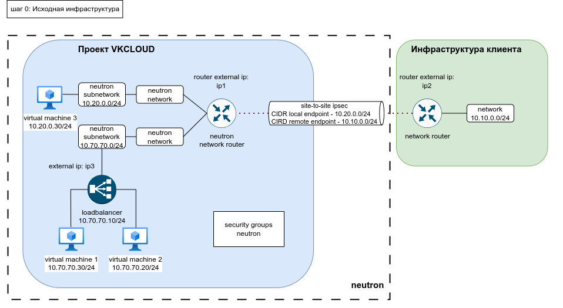
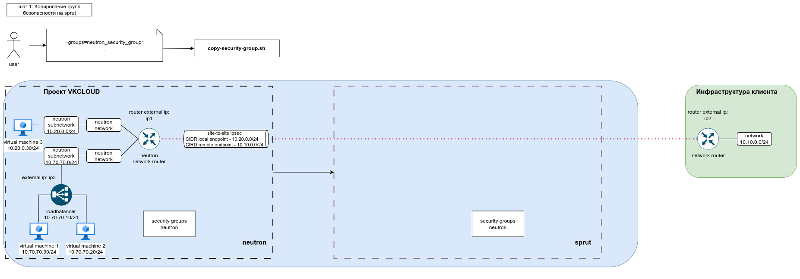
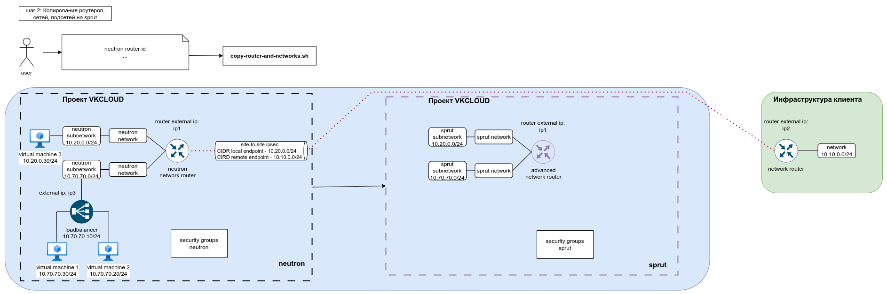
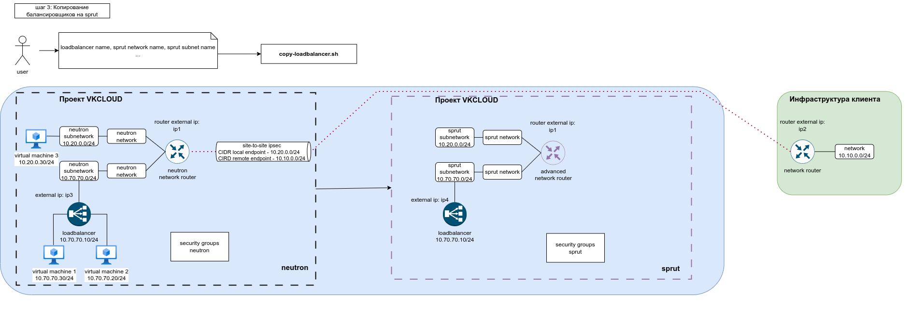
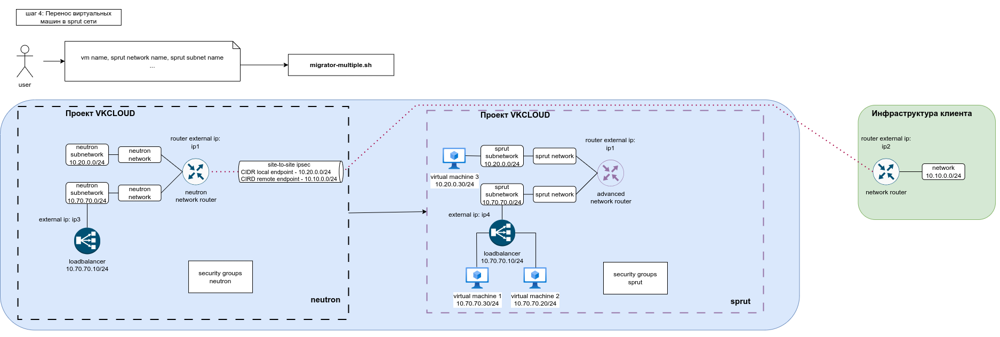
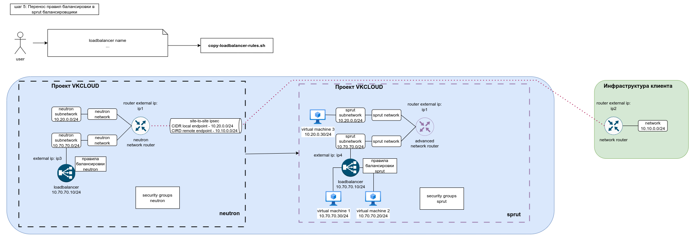
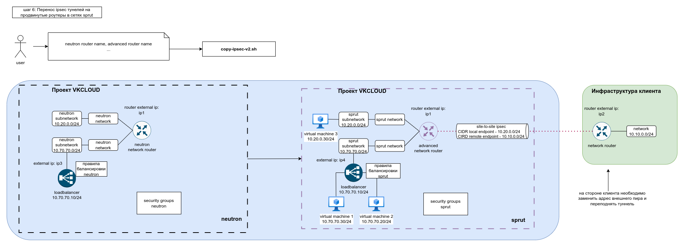
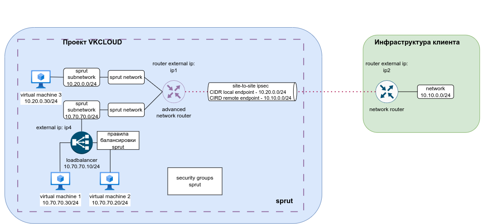

# Webinar

В данном документе будет описан тестовый сценарий миграции данного контура.




## Поднимаем стенд

```bash
cd terraform
```

```bash
terraform init
```

```bash
terraform apply --auto-approve
```

```bash
cd ../script-inputs
```

## Копирование групп безопасности



```bash
./../../../copy-security-group.sh --groups=webinar-secgroup-http
```

проверить что группы скопировались:

```bash
./../../../check-if-all-sprut-sg-present.sh
```

## Копирование роутеров сетей, подсетей


конфиг:

```shell
neutron router id,adv
```

```bash
./../../../copy-router-and-networks.sh copy-router-networks-input.csv
```

## Копирование балансировщика нагрузки

на балансировщик уходит ~5 минут

```bash
./../../../copy-loadbalancer.sh copy-loadbalancer-input.csv
```



## Миграция виртуальных машин

На данном этапе требуется техническое окно, так как переключение интерфейсов подразумевает потерю сетевой связности.

```bash
./../../../migrator-multiple.sh migrator-multiple-input.csv
```



## Копирование правил балансировки

```bash
./../../../copy-loadbalancer-rules.sh copy-loadbalancer-script-output-config.csv
```



## Копирование ipsec

```bash
./../../../copy-ipsec-v2.sh copy-ipsec-input.csv
```



## Итоговая инфраструктура

