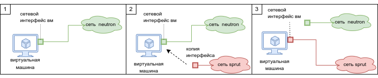

# Набор скриптов и инструкций для миграции виртуальных машин в SDN Sprut.

Миграция с neutron на sprut процесс, требующий дополнительные действия с точки зрения сетевой инфраструктуры, здесь они описаны.

О том что такое SDN, какие функциональные и нефункциональные премимущества между Neutron и Sprut смотрите [полное руководство](docs/Complete_migration_guide_to_Sprut.md).

Подробное описание каждого скрипта в директории [scripts](docs/scripts/).

Для того, чтобы опробовать скрипты для миграции на тестовых стендах, можно воспользоваться примерами в папке [examples](examples/). Все стенды поднимаются через terraform. Подробнее про [установку](https://cloud.vk.com/docs/ru/tools-for-using-services/terraform/quick-start).

В папке [presentations](presentations/) содержатся презентации с описанием sprut, миграции, целях и преимуществах.
- [Полная версия](presentations/Миграция%20на%20SDN%20Sprut.%20Full.pdf) с техническими подробностями
- [Короткая версия](presentations/Миграция%20на%20SDN%20Sprut.%20Short.pdf)

